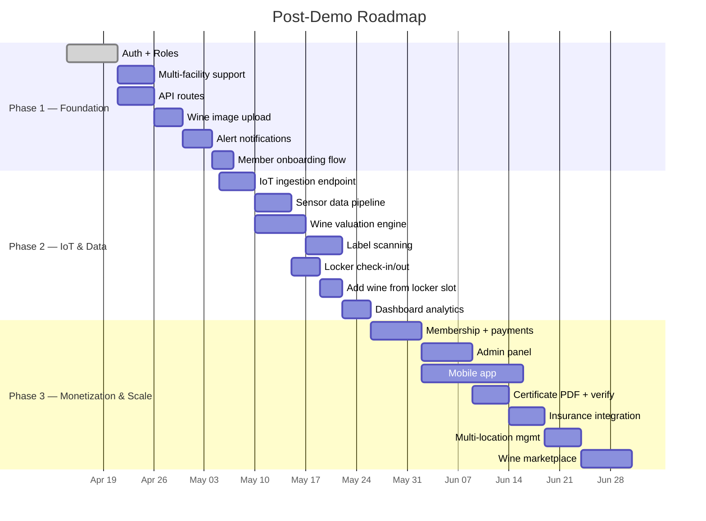

# Caveau MVP — Product Spec & Build Plan

## Context

Caveau is a luxury wine bar/retail/speakeasy concept for Naples, FL. The founder (Rob Saenz) and an investor are excited about the tech stack: a wine cellar management app + Sentinel IoT monitoring + provenance certificates. Nathaniel (developer) has been brought in by Sam (GM) to build a working demo app by Monday April 13, 2026. The app will be built by Claude Code in ~3 autonomous sessions over the weekend.

**Constraints:**
- One developer maintaining this long-term
- Keep it simple — fewer files, colocated code, no premature abstractions
- Host on Vercel (free tier), database on AWS RDS (free tier)
- Tried-and-true tech only — nothing bleeding edge

---

## Stack

| Layer | Choice | Why |
|-------|--------|-----|
| Framework | **Next.js 14** (App Router, TypeScript) | Industry standard, stable, huge ecosystem |
| Styling | **Tailwind CSS v3** | Proven, fast to iterate, great dark theme support |
| Charts | **Recharts v2** | Most popular React charting lib, well-documented |
| Animations | **Framer Motion** | Standard for React animations, simple API |
| Icons | **Lucide React** | Tree-shakeable, clean icon set |
| Database | **RDS PostgreSQL** (free tier) | AWS-native Postgres. Free tier: 12 months, db.t3.micro, 20GB storage |
| ORM | **Prisma** | Type-safe queries, auto-generated TypeScript types, migrations, seeding |
| Hosting | **Vercel** | The canonical Next.js host — zero-config, git-push deploys. Free tier: 100GB bandwidth, serverless functions, edge middleware |

**Why RDS + Prisma:** RDS is managed Postgres — same SQL, no vendor lock-in. Prisma handles migrations, generates TypeScript types from the schema (no manual `types.ts` needed for DB models), and provides a clean query API. Next.js Server Components query the database directly via Prisma — no separate API layer needed.

---

## Screens (6 total)

### 1. Dashboard (`/`)
Overview: collection value, locker status, current conditions, recent alerts, top wines by value.

### 2. My Collection (`/collection`)
Wine list with search + filters (region, varietal, vintage). Grid and list views. Add wine form. Click → wine detail.

### 3. My Locker (`/locker`)
Visual 4×8 grid of locker slots. Empty vs occupied. Click slot → slide-out panel with bottle info.

### 4. Sentinel Monitor (`/sentinel`)
IoT dashboard: 4 condition cards (temp, humidity, vibration, light), temperature area chart, humidity line chart, vibration gauge, alert history. Time range toggle (1H/6H/24H/7D/30D). Live-updating simulated data.

### 5. Wine Detail (`/wine/[id]`)
Full bottle profile: image, producer, region, vintage, tasting notes, purchase price vs current value, storage location, link to provenance certificate.

### 6. Provenance Certificate (`/certificate/[id]`)
Standalone printable page: wine info, monitoring period, environmental summary, SHA-256 integrity badge, certificate number. No sidebar.

---

## Design System

### Colors (defined in tailwind.config.ts)
```
Backgrounds:    #0A0A0B (black), #141416 (charcoal), #1C1C20 (graphite)
Borders:        #2A2A30 (slate)
Text:           #E8E6E1 (primary), #9B9A97 (secondary), #6B6B76 (muted)
Gold:           #FFD166 (accent), #D4A034 (text)
Burgundy:       #C23152 (wine accents)
Status:         #34D399 (ok), #FBBF24 (warn), #F87171 (danger), #60A5FA (info)
```

### Fonts
- **Playfair Display** (serif): headings, wine names, certificate titles
- **Inter** (sans): everything else
- Both loaded via `next/font/google`

### Card Style
All cards use: `bg-[#141416]/80 backdrop-blur-xl border border-[#2A2A30]/50 rounded-2xl`

---

## Data Models (Prisma)

> **Note on Prisma Decimal fields:** Prisma returns `Decimal` columns as `Prisma.Decimal` objects (string-backed), not native JS numbers. Any component displaying or computing with `purchasePrice`, `currentValue`, or sensor values must call `.toNumber()` or use `Number()` for arithmetic, and format with `utils.ts` helpers for display.

```prisma
// prisma/schema.prisma

generator client {
  provider = "prisma-client-js"
}

datasource db {
  provider = "postgresql"
  url      = env("DATABASE_URL")
}

model Facility {
  id        String   @id @default(uuid())
  name      String
  location  String   // e.g. "Naples, FL"
  createdAt DateTime @default(now()) @map("created_at")
  lockers   Locker[]

  @@map("facilities")
}

model Member {
  id        String   @id @default(uuid())
  name      String
  email     String   @unique
  tier      String   // 'gold', 'platinum', 'black'
  role      String   @default("member") // 'admin', 'staff', 'member'
  createdAt DateTime @default(now()) @map("created_at")
  wines     Wine[]
  lockers   Locker[]

  @@map("members")
}

model Wine {
  id               String    @id @default(uuid())
  name             String
  vintage          Int
  region           String
  varietal         String
  producer         String
  purchasePrice    Decimal   @map("purchase_price") @db.Decimal(10, 2)
  currentValue     Decimal   @map("current_value") @db.Decimal(10, 2)
  imageUrl         String?   @map("image_url")
  tastingNotes     String?   @map("tasting_notes")
  drinkWindowStart Int?      @map("drink_window_start")
  drinkWindowEnd   Int?      @map("drink_window_end")
  memberId         String?   @map("member_id")
  createdAt        DateTime  @default(now()) @map("created_at")
  member           Member?   @relation(fields: [memberId], references: [id], onDelete: SetNull)
  lockerSlots      LockerSlot[]
  certificates     ProvenanceCertificate[]
  valuations       WineValuation[]

  @@index([memberId])
  @@map("wines")
}

model WineValuation {
  id        String   @id @default(uuid())
  wineId    String   @map("wine_id")
  source    String   // 'manual', 'liv-ex', 'wine-searcher', etc.
  price     Decimal  @db.Decimal(10, 2)
  date      DateTime
  wine      Wine     @relation(fields: [wineId], references: [id], onDelete: Cascade)

  @@index([wineId, date(sort: Desc)])
  @@map("wine_valuations")
}

model Locker {
  id           String   @id @default(uuid())
  lockerNumber Int      @unique @map("locker_number")
  zone         String   // 'A', 'B', 'C'
  facilityId   String?  @map("facility_id")
  memberId     String?  @map("member_id")
  facility     Facility? @relation(fields: [facilityId], references: [id], onDelete: SetNull)
  member       Member?  @relation(fields: [memberId], references: [id], onDelete: SetNull)
  slots        LockerSlot[]
  readings     SensorReading[]
  alerts       Alert[]
  certificates ProvenanceCertificate[]

  @@index([facilityId])
  @@index([memberId])
  @@map("lockers")
}

model LockerSlot {
  id           String    @id @default(uuid())
  lockerId     String    @map("locker_id")
  slotPosition Int       @map("slot_position")
  wineId       String?   @map("wine_id")
  dateStored   DateTime? @map("date_stored")
  locker       Locker    @relation(fields: [lockerId], references: [id], onDelete: Cascade)
  wine         Wine?     @relation(fields: [wineId], references: [id], onDelete: SetNull)

  @@unique([lockerId, slotPosition])
  @@map("locker_slots")
}

model SensorReading {
  id          Int      @id @default(autoincrement())
  lockerId    String   @map("locker_id")
  temperature Decimal  @db.Decimal(5, 2)
  humidity    Decimal  @db.Decimal(5, 2)
  vibration   Decimal  @db.Decimal(5, 3)
  lightLux    Decimal  @map("light_lux") @db.Decimal(5, 2)
  timestamp   DateTime @default(now())
  locker      Locker   @relation(fields: [lockerId], references: [id], onDelete: Cascade)

  @@index([lockerId, timestamp(sort: Desc)])
  @@index([timestamp(sort: Desc)])
  @@map("sensor_readings")
}

model Alert {
  id        String   @id @default(uuid())
  lockerId  String   @map("locker_id")
  type      String   // 'temperature', 'humidity', 'vibration', 'light', 'door'
  severity  String   // 'info', 'warning', 'critical'
  message   String
  timestamp DateTime @default(now())
  resolved  Boolean  @default(false)
  locker    Locker   @relation(fields: [lockerId], references: [id], onDelete: Cascade)

  @@index([lockerId, timestamp(sort: Desc)])
  @@index([resolved, lockerId])
  @@map("alerts")
}

model ProvenanceCertificate {
  id                String   @id @default(uuid())
  wineId            String   @map("wine_id")
  lockerId          String   @map("locker_id")
  monitoringStart   DateTime @map("monitoring_start")
  monitoringEnd     DateTime @map("monitoring_end")
  tempMean          Decimal? @map("temp_mean") @db.Decimal(5, 2)
  tempMin           Decimal? @map("temp_min") @db.Decimal(5, 2)
  tempMax           Decimal? @map("temp_max") @db.Decimal(5, 2)
  humidityMean      Decimal? @map("humidity_mean") @db.Decimal(5, 2)
  dataIntegrityHash String   @map("data_integrity_hash")
  certificateNumber String   @unique @map("certificate_number")
  createdAt         DateTime @default(now()) @map("created_at")
  wine              Wine     @relation(fields: [wineId], references: [id], onDelete: Cascade)
  locker            Locker   @relation(fields: [lockerId], references: [id], onDelete: Cascade)

  @@map("provenance_certificates")
}
```

### Seed Data
- 1 facility: "Caveau Naples", location "Naples, FL"
- 1 member: "Robert Saenz", tier "black", role "member"
- 4 lockers: #7 (Zone A), #12 (Zone B), #19 (Zone C), #24 (Zone D) — all assigned to the facility
- 66 wines: 5 Caveau private label (matching pitch deck names), 8 investment-grade (DRC, Screaming Eagle, Petrus, etc.), 12 mid-range (Caymus, Silver Oak, etc.), 10 French classics, 10 Italian icons, 6 Spanish/Portuguese, 10 New World gems, 5 Champagne
- 66 occupied locker slots (of 128 total)
- 30 days of sensor readings at 5-min intervals (~34K rows across 4 lockers)
- 20 historical alerts (including access/badge scan events)
- 11 provenance certificates across multiple lockers
- 4-6 WineValuations per wine (329 total) with sources: "manual", "liv-ex", "wine-searcher", "auction" — powers dashboard analytics trend chart

### Sensor Simulation (client-side)
```
temp = 55.0 + sin((hour - 5) × π/12) + gaussian(0, 0.1)
humidity = 65.0 - (temp - 55.0) × 2.0 + gaussian(0, 0.3)
vibration = 0.1 + (random() < 0.005 ? random() * 1.5 : Math.abs(gaussian(0, 0.02)))
light = random() < 0.001 ? random(50, 200) : max(0, gaussian(0, 0.5))
```

**`gaussian(mean, stddev)`** returns a sample from a normal distribution. Implement via Box-Muller transform in `lib/sensors.ts`:
```ts
function gaussian(mean: number, stddev: number): number {
  const u1 = Math.random();
  const u2 = Math.random();
  const z = Math.sqrt(-2 * Math.log(u1)) * Math.cos(2 * Math.PI * u2);
  return mean + z * stddev;
}
```

Live updates via `setInterval` every 5 seconds. No SSE/WebSocket needed.

### Alert Generation

**Historical alerts (seed data):** The 20 historical alerts are manually seeded in `seed.ts` with realistic timestamps spread across the past 30 days. They include environmental threshold breaches (temperature, humidity, vibration) and access events (member/staff badge scans, after-hours access). They do not need to match actual sensor reading threshold breaches — they are demo data.

**Live alerts (client-side):** The Sentinel page evaluates thresholds on each simulated reading (every 5 seconds). When a reading breaches a threshold (temp >59°F or <50°F, humidity <55% or >75%, vibration >0.5 mm/s), display an alert in the alert list with a "NEW" badge. Live alerts are ephemeral (in-memory state only, not written to the database).

### Time Range Toggle Behavior

- **1H:** Show live simulated data generated client-side (last 60 minutes of simulated readings accumulated since page load, supplemented with the most recent hour of DB data on initial load).
- **6H, 24H, 7D, 30D:** Query historical `SensorReading` data from the database via Server Action or API route. No client-side simulation for these ranges.

### Image Fallback

When `Wine.imageUrl` is null, display a placeholder: a centered wine bottle silhouette icon (use Lucide `Wine` icon) on a dark card background (`bg-[#1C1C20]`) with muted text "No image". Apply this consistently on wine cards, wine detail page, and any other context where wine images appear.

### Certificate Stats Calculation

When seeding `ProvenanceCertificate` records, calculate `tempMean`, `tempMin`, `tempMax`, and `humidityMean` by querying `SensorReading` rows for the certificate's `lockerId` between `monitoringStart` and `monitoringEnd`, then aggregating with SQL `AVG()`, `MIN()`, `MAX()`. The `dataIntegrityHash` is a SHA-256 hash of the concatenated sensor reading IDs in that range (as a pipe-delimited string).

---

## Project Structure

See CLAUDE.md for the canonical `src/` file tree. Key points:

- **~20 source files total.** Each component file may contain multiple related sub-components.
- Prisma files live in `prisma/` (schema.prisma, seed.ts, seed-sensors.ts)
- Config files: package.json, next.config.mjs, tailwind.config.ts, .env

---

## Build Sessions

### Session 1: Foundation + Dashboard + Collection

1. **Scaffold** — `npx create-next-app@14 . --typescript --tailwind --eslint --app --src-dir --use-npm --no-import-alias` (use `@14`, not `@latest`, to ensure scaffolded files match Next.js 14 conventions)
2. **Install deps** — `prisma @prisma/client recharts@^2 framer-motion@^11 lucide-react@^0`
3. **Configure** — tailwind.config.ts (colors, fonts), globals.css (dark theme, glass-card utility), layout.tsx (Playfair + Inter fonts, dark bg, nav shell)
4. **Lib files** — prisma.ts (client singleton), utils.ts, sensors.ts
5. **Nav component** — Sidebar with Caveau ◈ logo + 4 links (desktop), bottom tab bar (mobile)
6. **Metric card component** — Reusable: icon + value + label + optional trend
7. **Database setup** — Create RDS instance, configure schema.prisma, run `prisma migrate deploy`, seed data
8. **Dashboard page** — 4 metric cards, recent alerts, top wines, current conditions
9. **Wine card component** — Image, name, vintage, region, value
10. **Collection page** — Search bar, region/varietal/vintage filters, grid/list toggle, wine cards, add wine form

**End of session 1:** Nav works, dashboard shows real data, collection is searchable/filterable.

### Session 2: Locker + Sentinel + Wine Detail

1. **Locker grid component** — 4×8 CSS grid with empty/occupied slot states, click → slide-in detail panel
2. **Locker page** — Locker header (number, zone, occupancy), locker grid
3. **Seed sensor data** — Write and run seed-sensors.ts (30 days of readings via Prisma)
4. **Sensor simulation** — Client-side generator in sensors.ts
5. **Sensor charts component** — Temperature area chart (gold gradient), humidity line chart (blue), vibration gauge, light indicator. All with Recharts.
6. **Alert list component** — Table with severity badges and timestamps
7. **Sentinel page** — Time range selector, 4 condition cards, charts, alert history, live updating
8. **Wine detail page** — Wine header (image + info), valuation card, tasting notes, storage location, provenance link

**End of session 2:** All 4 main screens working with real + simulated data.

### Session 3: Certificate + Polish + Deploy

1. **Certificate doc component** — Gold-bordered document layout, wine info, environmental summary, integrity badge, certificate number
2. **Certificate page** — Full-page standalone (no sidebar), print styles
3. **Animations** — Framer Motion: page fade-in, grid item stagger, card hover scale, number transitions
4. **Polish** — Loading skeletons, empty states, mobile check at 375px
5. **Vercel deploy** — Connect GitHub repo, set env vars, deploy
6. **Test** — Full demo flow on phone

**End of session 3:** Deployed at Vercel URL, all screens working, polished on mobile.

---

## RDS Setup (one-time)

1. AWS Console → RDS → Create database
2. Engine: PostgreSQL 15, Template: Free tier (db.t3.micro, 20GB gp2)
3. DB instance identifier: `caveau-db`, master username/password of your choice
4. Public access: Yes (for demo — restrict for production)
5. Security group: allow inbound PostgreSQL (port 5432) from your IP. For Vercel access, Vercel serverless functions use dynamic IPs — either use RDS public access with strong credentials, or set up a connection string with SSL. **Avoid `0.0.0.0/0` even for demo** — it exposes the database to the entire internet. For production, use a VPN or AWS PrivateLink.
6. Create database name: `caveau`
7. Copy the endpoint → set `DATABASE_URL=postgresql://<user>:<password>@<endpoint>:5432/caveau` in `.env`
8. Run `npx prisma migrate deploy` to push the schema
9. Run `npx prisma db seed` to populate demo data

---

## Vercel Deployment

1. Push code to GitHub
2. Go to [vercel.com](https://vercel.com) → New Project → Import GitHub repo
3. Vercel auto-detects Next.js — zero configuration needed
4. Add environment variables:
   - `DATABASE_URL` (RDS PostgreSQL connection string)
5. Deploy

Vercel runs `npx prisma generate` automatically via the `postinstall` script in package.json. No custom build config needed.

Custom domain (optional): Add in Vercel Dashboard → Settings → Domains.

---

## What to Skip

See "Not Yet Implemented" in CLAUDE.md for the exclusion list. Auth is now implemented. Still excluded: real API integrations (Liv-ex, Wine-Searcher), real IoT devices, payments, POS, admin panel.

---

## Demo Walkthrough (5 min)

1. **Dashboard** (30s) — "$48K collection, 24 bottles stored, conditions optimal"
2. **Collection** (45s) — Filter by Napa. Search "Petrus". Click to detail.
3. **Wine Detail** (30s) — "Purchased $4,500, now $4,800. Stored Locker 7."
4. **Locker** (30s) — "Visual map. Click any slot."
5. **Sentinel** (90s) — "Live monitoring: temp, humidity, vibration, light. Switch 1H → 7D. Alerts fire if conditions drift."
6. **Certificate** (45s) — "30 days continuous monitoring, SHA-256 verified. Carfax for wine."

---

## Verification

After each session:
- `npm run dev` starts clean
- All nav links work
- Data loads from database via Prisma
- Charts render on Sentinel page
- Works at 375px mobile width
- After session 3: Vercel URL works on phone

---

## Post-Demo Roadmap

Features 01–14 deliver a demo. The phases below are what turns it into a product. Schema groundwork (Facility, WineValuation, Member.role) is already in place from the demo build to minimize future migrations.

> **Note:** The feature numbers below (15–33) are a conceptual roadmap and are independent from the build pipeline's stretch goal numbers (15–17 in BUILD.md/BUILD_STATUS.json).



### Phase 1 — Foundation (weeks 1–3 post-demo)

Make it real enough for a pilot with actual members.

| # | Feature | Description |
|---|---------|-------------|
| 15 | Auth + Roles | NextAuth.js or Clerk. Login/signup. Role-based access: admin, staff, member. Replace hardcoded demo user. |
| 16 | Multi-facility support | Facility switcher in nav. Lockers scoped to facility. Members can belong to multiple facilities. |
| 17 | API routes | `/api/wines`, `/api/sensors`, `/api/alerts`, `/api/lockers`. REST endpoints wrapping Prisma queries. Needed for mobile app, POS, and IoT device integration. |
| 18 | Wine image upload | S3 bucket + CloudFront CDN. Presigned upload URLs from API route. Resize/optimize on upload via Sharp or Lambda. |
| 19 | Alert notifications | Real-time email alerts via AWS SES when sensor thresholds are breached. Configurable per-member notification preferences. |
| 20 | Member onboarding flow | Sign up → select tier → assign locker → first bottle check-in. Guided walkthrough for new members. |

### Phase 2 — IoT & Data (weeks 4–6)

Connect to real hardware. Make the data real.

| # | Feature | Description |
|---|---------|-------------|
| 21 | IoT ingestion endpoint | HTTP webhook or MQTT bridge for real Sentinel sensor devices. Validates payload, writes to SensorReading, triggers alert evaluation. |
| 22 | Sensor data pipeline | Partition `sensor_readings` by month. Background job aggregates raw readings into hourly/daily rollup tables. Retention policy: raw data 90 days, rollups indefinitely. |
| 23 | Wine valuation engine | Populate WineValuation table from Liv-ex API (or manual bulk CSV import). Show price history chart on wine detail. Appreciation tracking on dashboard. |
| 24 | Label scanning | Phone camera → OCR via Google Cloud Vision or wine-specific API (Vivino, Wine-Searcher). Auto-fill wine form fields from label photo. |
| 25 | Locker check-in / check-out | Staff workflow: scan bottle barcode → assign to slot or remove from slot. Full audit trail in a new `LockerActivity` model. |
| 26 | Dashboard analytics | Collection performance over time (line chart), storage utilization trends, alert frequency heatmap, top appreciating bottles. Real KPIs, not just current snapshots. |

### Phase 3 — Monetization & Scale (weeks 7–12)

Turn it into a business.

| # | Feature | Description |
|---|---------|-------------|
| 27 | Membership + payments | Stripe integration. Tier-based monthly subscriptions. Storage fees per locker slot. Billing portal. |
| 28 | Admin panel | Staff-facing dashboard: manage members, assign/reassign lockers, review alerts, issue certificates. Separate layout from member-facing app. |
| 29 | Mobile app | React Native (Expo). Push notifications for alerts. Collection browsing, locker check-in via camera, certificate sharing. |
| 30 | Certificate PDF export + public verification | Generate print-ready PDF certificates. Public `/verify/[hash]` URL for third-party verification. QR code on physical bottle tags links to verification page. |
| 31 | Insurance integration | Export standardized condition reports (PDF) for wine insurance carriers. Continuous monitoring proof for premium reduction claims. |
| 32 | Multi-location management | Cross-facility transfers, consolidated dashboard for operators with multiple locations, location-level analytics. |
| 33 | Wine marketplace | Member-to-member trading within the platform. Listing, offers, provenance transfer on sale. Commission model. |
| 34 | Wine disposition tracking | Record when a bottle leaves the collection: sold, transferred, consumed, gifted, or removed. New `status` field on Wine (`in_cellar` default, plus disposition states) and a `WineDisposition` table (event type, date, sale price, recipient, notes). Collection page filters to active wines by default with a "History" toggle to browse past bottles. Dashboard metrics scoped to active wines. Full provenance, valuation history, and storage records preserved. Prerequisite for marketplace (#33) and insurance (#31). |
| 35 | Locker self-service (member) | Members can assign wines to empty locker slots from the locker page. Tap an empty slot → modal shows unassigned wines in the member's collection → select one → slot is filled. Also allows removing a wine from a slot (returns it to unassigned). Distinct from staff check-in (#25) which uses barcode scanning and audit trails. |
| 36 | Add wine from locker slot | Extend the empty-slot picker modal (#35) with an "Add New Wine" option. Opens the add-wine form inline (reuses `add-wine-form` component). On submit, creates the wine in the member's collection AND auto-assigns it to the selected slot in one action. Eliminates the round-trip of going to Collection → add wine → back to Locker → assign. Server action creates the wine + updates the slot in a single transaction. |

### Code Audit — Technical Debt Backlog (April 2026)

Full codebase audit identified the items below. Security hotfixes (certificate IDOR, email normalization, signup hardening, demo credential gating) were fixed immediately. Remaining items are slotted into the phase where they become load-bearing.

#### Phase 1 — Foundation (address alongside features 15–20)

**Security hardening:**
- ~~Rate limiting on `/api/auth/signup` and login~~ — DONE: in-memory per-IP limiter (5 req/60s) in middleware. Migrate to Redis for production scaling.
- Tighten CSP: replace `unsafe-inline` with nonces (blocked by Next.js App Router inline script injection)
- ~~Add explicit `maxAge` to JWT session config~~ — DONE: set to 4 hours (14400s)
- ~~Add CSRF token to signup form~~ — DONE: double-submit cookie with SHA-256 hash verification

**Schema integrity:**
- ~~Define Prisma enums for `Member.role`, `Member.tier`, `Alert.type`, `Alert.severity`~~ — DONE: all enum types defined
- ~~Add `@@unique([wineId, date, source])` on `WineValuation`~~ — DONE
- Make `Wine.memberId` and `Locker.memberId` non-nullable (currently `SetNull` on delete creates orphaned records)
- ~~Initialize Prisma migrations~~ — DONE: baseline migration at `prisma/migrations/0001_init.sql`
- ~~Add missing composite indexes~~ — DONE: added LockerSlot.wineId, Alert.lockerId standalone, WineDisposition unique constraint
- Remove low-cardinality indexes on `Member.tier` and `Member.role` (PostgreSQL ignores them anyway)

**Testing:**
- ~~Add test framework (Vitest or Jest)~~ — DONE: Vitest configured
- ~~Unit tests for `lib/sensors.ts` (simulation logic), `lib/utils.ts` (formatters)~~ — DONE
- Integration tests for API routes (auth, wines, sensors, certificates)
- E2E tests for critical flows (login, add wine, view locker)

**Accessibility (WCAG AA):**
- ~~Add `aria-label` to all icon-only buttons~~ — DONE
- ~~Fix color contrast: `#6B6B76` muted text~~ — DONE: lightened to `#8B8B96`
- ~~Add visible `:focus-visible` ring on all interactive elements~~ — DONE
- ~~Increase touch targets to minimum 44x44px~~ — DONE
- ~~Add `prefers-reduced-motion` media queries~~ — DONE
- ~~Add `role="tablist"` / `role="tab"` to locker selector and sentinel time range~~ — DONE
- ~~Add `aria-live="polite"` region for live sensor updates~~ — DONE

#### Phase 2 — IoT & Data (address alongside features 21–26)

**Query performance:**
- Fix N+1 in `/api/sensors/latest/route.ts`: replace per-locker loop with single `findMany` using `distinct: ['lockerId']`
- Combine two-step locker ID + alert fetch in `/api/alerts/route.ts` into single nested Prisma query
- Add `select` clauses to over-fetching queries (wine detail includes full locker/certificate objects but only uses 2-3 fields)
- Replace `` with `next/image` in `wine-card.tsx` + configure `images.remotePatterns` in `next.config.mjs`

**Caching:**
- Replace blanket `force-dynamic` with ISR (`revalidate: 60`) on collection, dashboard, locker pages
- Add `revalidatePath()` calls on mutations (already done for `/collection`, extend to others)
- Consider connection pooling for serverless (Prisma Accelerate or PgBouncer) as sensor data grows

**Code quality:**
- Extract magic numbers to `lib/constants.ts` (locker slot count `32`, readings per hour `720`, time range defaults)
- Move inline `addWine` server action from `collection/page.tsx` to `collection/actions.ts` (match sentinel pattern)
- Create consistent Decimal serializer utility — currently uses `Number()`, `.toString()`, `.toNumber()` inconsistently across routes
- Import sensor simulation from `lib/sensors.ts` in `seed-sensors.ts` instead of duplicating it
- Use `createMany()` in seed scripts instead of individual creates (~500 queries → ~5)

**UX:**
- Add error UI on dashboard data fetch failure (currently renders `$0` silently)
- Add toast/notification on successful wine add (modal closes with no feedback)
- Add `aria-live` region announcing live sensor data updates for screen readers

#### Phase 3 — Monetization & Scale (address alongside features 27–33)

**Infrastructure:**
- Add error tracking (Sentry) — `console.error()` in server components doesn't surface in production
- Add Prisma connection pooling config for serverless (`directUrl` for migrations, pooled `url` for runtime)
- Replace Framer Motion with CSS transitions in `metric-card.tsx` (saves ~40KB for a single hover animation)
- Add `output: "standalone"` to `next.config.mjs` if moving to Docker/ECS
- Replace `dangerouslySetInnerHTML` for print CSS with plain `<style>` JSX in certificate pages

### Infrastructure Scaling Notes

| Concern | Demo State | Production Path |
|---------|-----------|-----------------|
| Database | RDS db.t3.micro (free tier) | RDS db.t3.medium+ with read replicas. Connection pooling via PgBouncer or Prisma Accelerate. |
| Sensor data | ~34K rows (30 days, 4 lockers) | Millions of rows/year. Partition by month, rollup aggregation, TimescaleDB extension if needed. |
| Images | No images (placeholder URLs) | S3 + CloudFront. Lambda@Edge for on-the-fly resizing. |
| Auth | Hardcoded demo user | NextAuth.js with JWT sessions. Row-level security via Prisma middleware or PostgreSQL RLS. |
| Hosting | Vercel (free tier) | Vercel Pro for more bandwidth, or self-host on AWS with Docker/ECS for full control. |
| Monitoring | None | CloudWatch alarms, Sentry for error tracking, Grafana for sensor dashboards (internal). |
| CI/CD | build.sh pipeline | GitHub Actions: lint, type-check, build, deploy on merge to main. |
