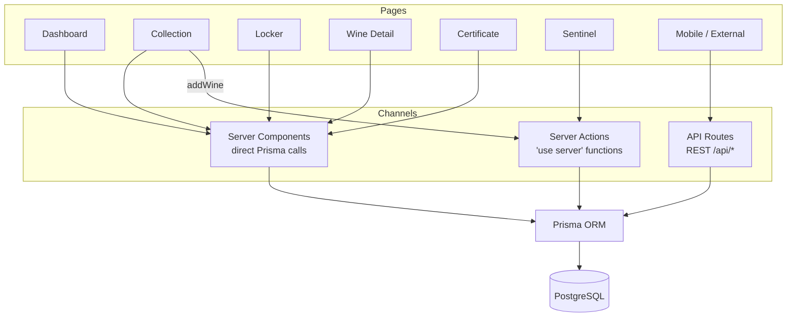

# API Reference

> Last updated: 2026-04-11 | Core features complete, API routes pending (stretch goal)

## Status

API routes are implemented. All endpoints require authentication via NextAuth JWT session (except `/api/auth/*`). Data is scoped to the authenticated member.

## Endpoints

| Method | Path | Auth | Description |
|--------|------|------|-------------|
| GET | `/api/wines` | Yes | List wines (supports `?search=`, `?region=`, `?varietal=`) |
| GET | `/api/wines/[id]` | Yes | Single wine with locker slot and valuations |
| POST | `/api/wines` | Yes | Create a wine (via server action) |
| GET | `/api/lockers` | Yes | List lockers with occupancy counts |
| GET | `/api/lockers/[id]/slots` | Yes | Slots for a locker with wine info |
| GET | `/api/sensors/latest` | Yes | Latest sensor reading per locker |
| GET | `/api/sensors/history` | Yes | Historical readings (`?lockerId=`, `?range=`) |
| GET | `/api/alerts` | Yes | Recent alerts (`?resolved=true/false`) |
| GET | `/api/certificates/[id]` | Yes | Certificate with wine and locker data (ownership verified) |
| POST | `/api/auth/signup` | No | Create account (email format validated, 8-char min password) |
| `*` | `/api/auth/[...nextauth]` | No | NextAuth handlers (login, CSRF, session) |

## Data Access

Data reaches the database through three channels depending on the rendering strategy:

- **Server Components** — call Prisma directly (Dashboard, Collection, Locker, Wine Detail, Certificate)
- **Server Actions** — called from Client Components (Sentinel fetches historical data, Collection adds wines)
- **API Routes** — REST endpoints with auth guards, primarily for mobile/external consumers

See [ARCHITECTURE.md](./ARCHITECTURE.md) for detailed data flow diagrams.
