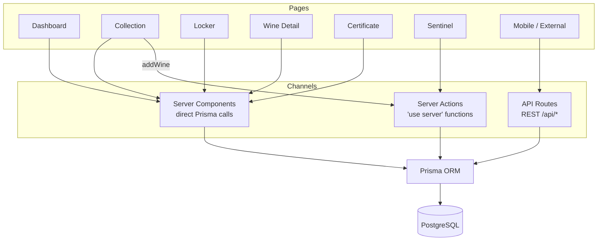

# API Reference

> Last updated: 2026-04-13 | REST surface live (roadmap #17)

## Status

API routes are implemented. All endpoints require authentication via NextAuth JWT session except `/api/auth/*` and `/api/health`. Authenticated endpoints read `getServerAuth()` and scope all queries to the authenticated member. Request bodies and query strings are parsed with Zod schemas from `src/lib/schemas.ts` and return a generic 400 on validation failure.

## Endpoints

| Method | Path | Auth | Description |
|--------|------|------|-------------|
| GET | `/api/wines` | Yes | List wines (supports `?search=`, `?region=`, `?varietal=`) |
| POST | `/api/wines` | Yes | Create a wine |
| GET | `/api/wines/[id]` | Yes | Single wine with locker slot and valuations |
| GET | `/api/wines/[id]/valuations` | Yes | List valuation history for a wine |
| POST | `/api/wines/[id]/valuations` | Yes | Add a valuation entry for a wine |
| GET | `/api/lockers` | Yes | List lockers with occupancy counts, scoped to current facility |
| GET | `/api/lockers/[id]/slots` | Yes | Slots for a locker with wine info |
| GET | `/api/sensors/latest` | Yes | Latest sensor reading per locker |
| GET | `/api/sensors/history` | Yes | Historical readings (`?lockerId=`, `?range=`) — rate-limited 30 / 60s per IP |
| GET | `/api/alerts` | Yes | Recent alerts (`?resolved=true/false`) |
| GET | `/api/certificates/[id]` | Yes | Certificate with wine and locker data (ownership verified) |
| POST | `/api/auth/signup` | No | Create account (email validated, 10-char min password with upper+lower+digit, CSRF double-submit verified) — rate-limited 5 / 60s per IP |
| `*` | `/api/auth/[...nextauth]` | No | NextAuth handlers (login, CSRF, session) — login rate-limited 10 / 60s per IP |
| GET | `/api/health` | No | Public uptime probe — returns `{ ok: true }` |

Wine bottle photo uploads (#18) are **not** exposed as a REST endpoint; they run through the `getUploadUrl` server action in `src/app/wine/[id]/actions.ts`, which mints a presigned S3 PUT URL that the browser uploads to directly. Public verification of certificate hashes is served by the `/verify/[hash]` page (SSR with per-IP rate limiting), not an API route.

## Data Access

Data reaches the database through three channels depending on the rendering strategy:

- **Server Components** — call Prisma directly (Dashboard, Collection, Locker, Wine Detail, Certificate)
- **Server Actions** — called from Client Components (Sentinel fetches historical data, Collection adds wines)
- **API Routes** — REST endpoints with auth guards, primarily for mobile/external consumers

See [ARCHITECTURE.md](./ARCHITECTURE.md) for detailed data flow diagrams.
