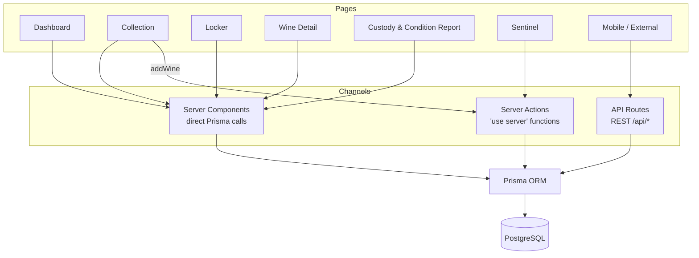

# API Reference

> Last updated: 2026-04-23 | REST surface live (roadmap #17); expanded across #19, #21, #30, #39, #40, #50, #51, #61

## Status

API routes are implemented. Member-facing endpoints require authentication via NextAuth JWT session. Public endpoints exist for health checks, device ingest, SES webhooks, Vercel cron, and token-scoped driver handoff flows (see tables below). Authenticated endpoints read `getServerAuth()` and scope all queries to the authenticated member. Request bodies and query strings are parsed with Zod schemas from `src/lib/schemas.ts` and return a generic 400 on validation failure.

## Endpoints

### Member-facing (JWT session required)

| Method | Path | Description |
|--------|------|-------------|
| GET | `/api/wines` | List wines (`?search=`, `?region=`, `?varietal=`) |
| POST | `/api/wines` | Create a wine |
| GET | `/api/wines/[id]` | Single wine with locker slot and valuations |
| GET | `/api/wines/[id]/valuations` | Valuation history for a wine |
| POST | `/api/wines/[id]/valuations` | Add a valuation entry |
| GET | `/api/lockers` | List lockers with occupancy, scoped to current facility |
| GET | `/api/lockers/[id]/slots` | Slots for a locker with wine info |
| GET | `/api/sensors/latest` | Latest sensor reading per locker |
| GET | `/api/sensors/history` | Historical readings (`?lockerId=`, `?range=`) — 30/60s per IP |
| GET | `/api/alerts` | Recent alerts (`?resolved=true/false`) |
| GET | `/api/certificates/[id]` | Custody & Condition Report data (ownership verified) |
| GET | `/api/certificates/[id]/provenance` | Full provenance timeline payload for #40 (ownership verified) |
| GET | `/api/appraisals/[id]/pdf` | Member-scoped appraisal PDF download (#61). 404 for non-owned or non-completed docs. |
| POST | `/api/advisor/chat` | Streaming SSE AI Advisor chat (#50). Returns 503 when `ANTHROPIC_API_KEY` is unset. |
| POST | `/api/deliveries` | Create a Deliver Now request and return the 4-digit PIN **once** (#51) |
| POST | `/api/deliveries/[id]/biometric` | Deliver Now biometric re-auth step (#51) |
| POST | `/api/deliveries/[id]/pin` | Delivery PIN verification step (#51) |
| POST | `/api/deliveries/[id]/address` | Delivery address confirmation step (#51) |
| POST | `/api/deliveries/[id]/otp` | OTP step-up verification (>$2K deliveries) (#51) |
| POST | `/api/deliveries/[id]/otp/send` | Trigger OTP send to member's verified channel (#51) |
| POST | `/api/deliveries/[id]/cancel` | Cancel an in-flight Deliver Now request (#51) |

### Auth

| Method | Path | Description |
|--------|------|-------------|
| POST | `/api/auth/signup` | Create account (email validated, 12-char min password with upper+lower+digit+symbol, CSRF double-submit) — 5/60s per IP, fail-closed |
| `*` | `/api/auth/[...nextauth]` | NextAuth handlers (login, CSRF, session) — login 10/60s per IP, fail-closed |

### Public / token-scoped

| Method | Path | Description |
|--------|------|-------------|
| GET | `/api/health` | Uptime probe — `{ ok: true }` |
| POST | `/api/ingest/sensor` | Sentinel device ingest (#21). Requires `Authorization: Bearer $SENTINEL_INGEST_SECRET` in staging/prod; unauthenticated in dev. |
| POST | `/api/ses/webhook` | SES bounce/complaint webhook (#19). Signed payload from SNS. |
| POST | `/api/deliveries/by-token/[token]/handoff-start` | Driver starts a Deliver Now handoff (#51) |
| POST | `/api/deliveries/by-token/[token]/id-scan` | Driver submits ID scan + name-match (#51, FL DABT) |
| POST | `/api/deliveries/by-token/[token]/upload-url` | Mint presigned S3 PUT for driver-side photo capture (#51) |
| POST | `/api/deliveries/by-token/[token]/complete` | Driver marks delivery complete with photo + timestamp (#51) |

### Cron (Vercel)

| Method | Path | Description |
|--------|------|-------------|
| POST | `/api/cron/livex-sync` | Daily Liv-ex price sync (#39). Guarded by `Authorization: Bearer $CRON_SECRET` in prod; dev allows unauthenticated. Timing-safe comparison. |
| POST | `/api/cron/sensor-retention` | Nightly purge of `SensorReading` rows older than 90 days (#22 interim). Same bearer guard. |

Wine bottle photo uploads (#18) are **not** exposed as a REST endpoint; they run through the `getUploadUrl` server action in `src/app/wine/[id]/actions.ts`, which mints a presigned S3 PUT URL that the browser uploads to directly. Public verification of Custody & Condition Report hashes is served by the `/verify/[hash]` page (SSR with per-IP rate limiting), not an API route. NFC tap-to-verify is served by the `/bottle/[tagId]` page (#43), not an API route.

## Data Access

Data reaches the database through three channels depending on the rendering strategy:

- **Server Components** — call Prisma directly (Dashboard, Collection, Locker, Wine Detail, Custody & Condition Report)
- **Server Actions** — called from Client Components (Sentinel fetches historical data, Collection adds wines)
- **API Routes** — REST endpoints with auth guards, primarily for mobile/external consumers

See [ARCHITECTURE.md](./ARCHITECTURE.md) for detailed data flow diagrams.
