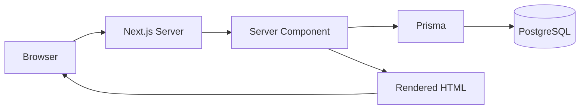
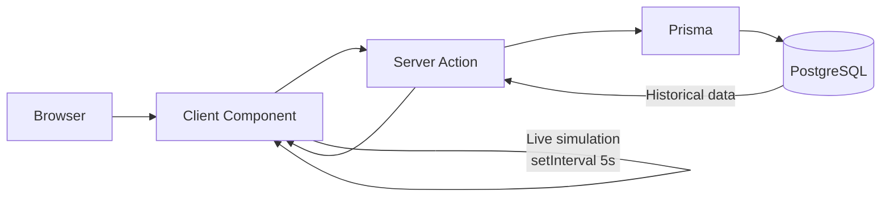
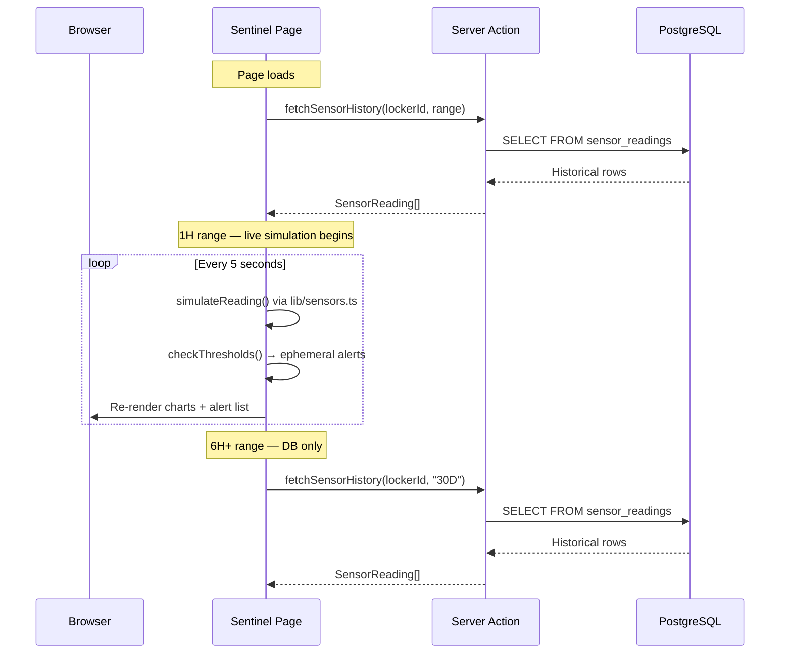

# Architecture

> Last updated: 2026-04-13 | 14 core + 3 stretch features complete; 14 of 24 roadmap features done

## Overview

Caveau is a **Next.js 14 App Router** application with a **PostgreSQL** backend via **Prisma ORM**. It serves as a luxury wine cellar management demo combining wine inventory, locker visualization, IoT environmental monitoring, and provenance certificates.

## Stack

| Layer | Technology | Purpose |
|-------|-----------|---------|
| Framework | Next.js 14 (App Router) | Full-stack React with SSR/SSG |
| Language | TypeScript | Type safety across the entire stack |
| Styling | Tailwind CSS v3 | Utility-first CSS with custom dark theme |
| Charts | Recharts v2 | Data visualization (sensor charts) |
| Animations | Framer Motion v11 | Page transitions, hover effects, stagger |
| Icons | Lucide React | Tree-shakeable icon library |
| Database | PostgreSQL (AWS RDS) | Relational data store |
| ORM | Prisma 5 | Schema management, type-safe queries, migrations |
| Hosting | Vercel | Zero-config Next.js deploys, CDN, SSL |

## Directory Structure

```
caveau-app/
├── prisma/                     # Database layer
│   ├── schema.prisma           # Data models → generates TypeScript types
│   ├── migrations/             # SQL migration baseline
│   ├── seed.ts                 # Core seed data
│   └── seed-sensors.ts         # Sensor reading history
├── src/
│   ├── app/                    # Next.js App Router pages
│   │   ├── layout.tsx          # Root layout (fonts, dark bg, SessionProvider)
│   │   ├── globals.css         # Tailwind base + glass-card utilities
│   │   ├── error.tsx           # Global error boundary
│   │   ├── not-found.tsx       # 404 page
│   │   ├── loading.tsx         # Root loading skeleton
│   │   ├── page.tsx            # Dashboard (server component)
│   │   ├── dashboard-client.tsx
│   │   ├── facility-actions.ts # Server actions for nav facility switcher (#16)
│   │   ├── auth/
│   │   │   ├── layout.tsx      # Minimal layout
│   │   │   ├── login/page.tsx  # Login screen
│   │   │   └── signup/page.tsx # Signup screen (auto-routes to /onboarding)
│   │   ├── onboarding/         # Guided 3-step wizard for new members (#20)
│   │   ├── settings/           # Alert notification preferences (#19)
│   │   ├── collection/         # Wine inventory (server + client hybrid)
│   │   ├── locker/             # Locker visualization + server actions
│   │   ├── sentinel/           # IoT monitoring + server actions
│   │   ├── wine/[id]/          # Wine detail + disposition/valuation/image actions
│   │   ├── certificate/[id]/   # Provenance certificate
│   │   ├── verify/[hash]/      # Public certificate verification
│   │   └── api/                # REST endpoints
│   │       ├── auth/
│   │       │   ├── [...nextauth]/route.ts
│   │       │   └── signup/route.ts
│   │       ├── wines/          # GET list + POST create, [id] GET, [id]/valuations GET+POST
│   │       ├── lockers/        # GET list, [id]/slots GET
│   │       ├── sensors/        # latest GET, history GET (rate-limited)
│   │       ├── alerts/         # GET recent
│   │       ├── certificates/[id]/route.ts  # GET (ownership-checked)
│   │       └── health/route.ts # Public uptime probe
│   ├── middleware.ts            # Auth gate, onboarding gate, per-route rate limiting, CSP headers
│   ├── types/
│   │   └── next-auth.d.ts      # Session augmentation (role, tier, onboarded)
│   ├── components/             # Shared UI components
│   │   ├── providers.tsx       # SessionProvider wrapper
│   │   ├── nav.tsx             # Sidebar (desktop) + bottom tabs (mobile) + facility switcher
│   │   ├── metric-card.tsx     # Stat card (icon + value + label)
│   │   ├── wine-card.tsx       # Wine card for grid/list views
│   │   ├── wine-image-upload.tsx # Presigned S3 upload UI (#18) — no-ops when bucket unset
│   │   ├── locker-grid.tsx     # 4×8 slot grid + detail panel + filter bar (#38)
│   │   ├── sensor-charts.tsx   # Temp/humidity/vibration charts + access log
│   │   ├── dashboard-charts.tsx # Analytics (value trend, utilization, alerts)
│   │   ├── alert-list.tsx      # Alert history table
│   │   ├── certificate-doc.tsx # Certificate layout + QR code
│   │   ├── add-wine-form.tsx   # Add wine modal
│   │   ├── disposition-form.tsx # Wine disposition dialog
│   │   ├── valuation-chart.tsx # Wine price history chart
│   │   └── skeleton.tsx        # Loading skeleton primitives
│   └── lib/                    # Shared utilities
│       ├── auth.ts             # NextAuth config + getServerAuth() helper
│       ├── prisma.ts           # Prisma client singleton
│       ├── env.ts              # Boot-time env validation
│       ├── logger.ts           # Structured logging
│       ├── rate-limit.ts       # In-memory per-IP token bucket
│       ├── safe-callback.ts    # Open-redirect-safe callbackUrl validator
│       ├── schemas.ts          # Zod request/body schemas + parseOr400 helper
│       ├── current-facility.ts # Facility cookie read/write for #16 switcher
│       ├── email.ts            # AWS SES client + send() wrapper (no-op when unset)
│       ├── notify-alert.ts     # Alert → email dispatch with cooldown tracking (#19)
│       ├── s3.ts               # Presigned upload URLs + getPublicUrl (#18)
│       ├── certificate-hash.ts # HMAC certificate hash generation/verification
│       ├── use-body-scroll-lock.ts # Hook for locking background scroll behind modals
│       ├── utils.ts            # Formatters (currency, date, sensors)
│       ├── sensors.ts          # Sensor simulation + threshold checks
│       └── __tests__/          # Vitest unit tests for lib helpers
├── docs/                       # Developer documentation (you are here)
└── [config files]              # package.json, tailwind.config.ts, etc.
```

## Data Flow

### Server Components (default)
Most pages are **Server Components** — they run on the server and can query Prisma directly:



Pages using this: Dashboard, Collection, Wine Detail, Certificate, Locker.

### Client Components (interactive)
Pages requiring `setInterval`, event handlers, or browser APIs use **Client Components** with `'use client'`. These cannot call Prisma directly — they fetch data via **Server Actions**:



Pages using this: Sentinel (live sensor updates).

### Sensor Data Flow
The Sentinel page combines two data sources:



1. **Historical** — queried from `sensor_readings` table via Server Action (for 6H+ ranges)
2. **Live** — generated client-side by `lib/sensors.ts` every 5 seconds (for 1H range)

Live alerts are ephemeral (in-memory only, never written to the database).

### Auth Flow


## Key Design Decisions

See [DECISIONS.md](./DECISIONS.md) for the full decision log.

## Rendering Strategy

| Page | Type | Auth | Data Source |
|------|------|------|-------------|
| Dashboard (`/`) | Server Component | Required | Prisma (aggregates) |
| Collection (`/collection`) | Server + Client hybrid | Required | Prisma fetch → client-side filter/sort + add-wine action |
| Locker (`/locker`) | Server + Client hybrid | Required | Prisma fetch → client-side interaction + slot actions |
| Sentinel (`/sentinel`) | Client Component | Required | Server Actions + 5s live simulation |
| Wine Detail (`/wine/[id]`) | Server Component | Required | Prisma (wine + valuations + dispositions) |
| Certificate (`/certificate/[id]`) | Server Component | Required (ownership-checked) | Prisma (certificate + stats) |
| Verify (`/verify/[hash]`) | Server Component | **Public** | Prisma (hash lookup, rate-limited) |
| Onboarding (`/onboarding`) | Server + Client hybrid | Required (un-onboarded only) | Prisma fetch → 3-step wizard server actions |
| Settings (`/settings`) | Server Component | Required | Prisma (member preferences + form action) |
| Login / Signup (`/auth/*`) | Client Component | **Public** | NextAuth + signup API |
