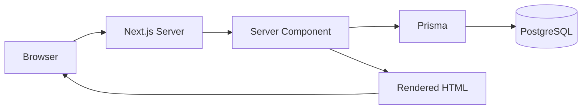
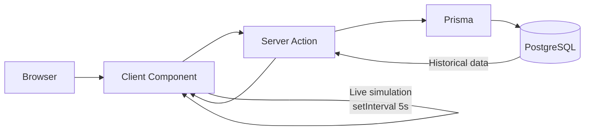
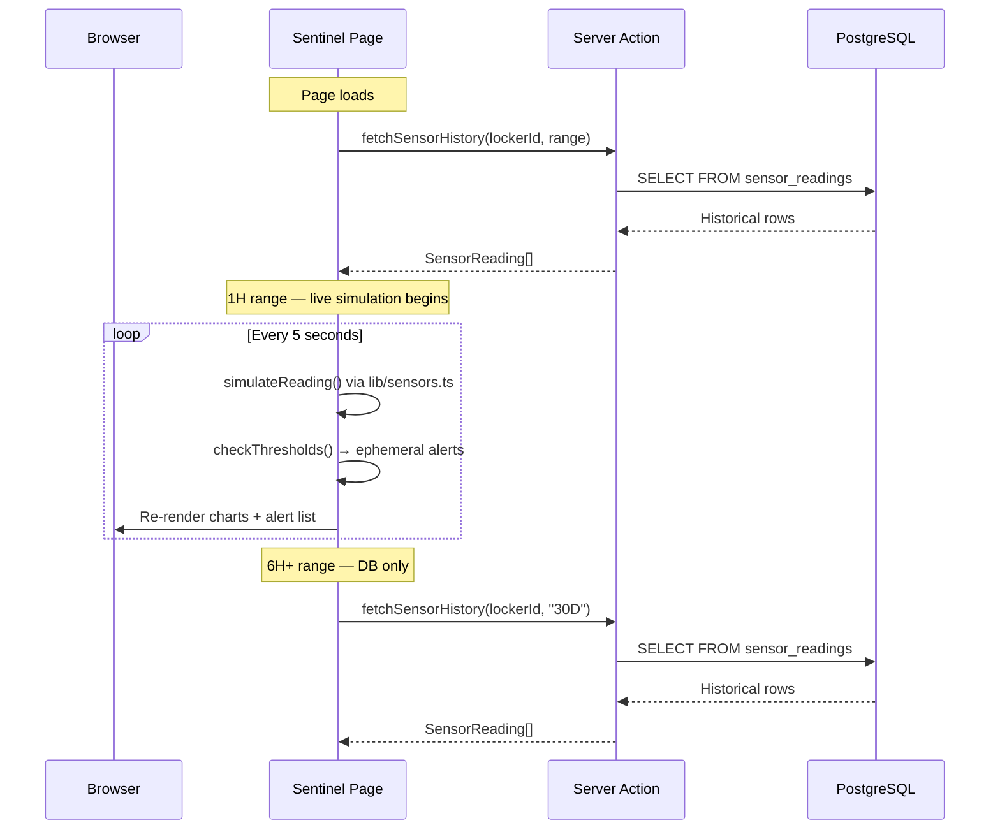
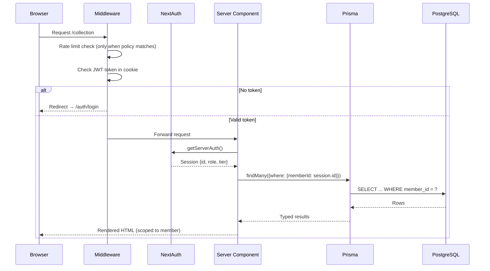

# Architecture

> Last updated: 2026-05-04 | Phase 6 complete; 40 of 47 post-demo roadmap features done (excluding #33)

The directory overview below is a conceptual map of the major surfaces and may not list every nested file. For setup and day‑to‑day workflow, see `docs/GETTING_STARTED.md` and `AGENTS.md`.

## Overview

Caveau is a **Next.js 15 App Router** application with a **PostgreSQL** backend via **Prisma ORM**. It serves as a luxury wine cellar management demo combining wine inventory, locker visualization, IoT environmental monitoring, and Caveau Custody & Condition Reports.

## Stack

| Layer | Technology | Purpose |
|-------|-----------|---------|
| Framework | Next.js 15 (App Router) | Full-stack React with SSR/SSG |
| Language | TypeScript | Type safety across the entire stack |
| Styling | Tailwind CSS v3 | Utility-first CSS with custom dark theme |
| Charts | Recharts v2 | Data visualization (sensor charts) |
| Animations | Framer Motion v11 | Page transitions, hover effects, stagger |
| Icons | Lucide React | Tree-shakeable icon library |
| Database | PostgreSQL (AWS RDS) | Relational data store |
| ORM | Prisma 5 | Schema management, type-safe queries, migrations |
| Hosting | Vercel | Zero-config Next.js deploys, CDN, SSL |

## Directory Structure

```
caveau-app/
├── prisma/                     # Database layer (43 models, 34 enums)
│   ├── schema.prisma
│   ├── migrations/             # Flat SQL migrations 0001..0047
│   ├── seed.ts
│   └── seed-sensors.ts
├── src/
│   ├── app/                    # Next.js App Router
│   │   ├── (root)              # layout.tsx, page.tsx, dashboard-client.tsx, globals.css, error.tsx, not-found.tsx, loading.tsx, facility-actions.ts
│   │   ├── admin/              # RBAC-gated admin shell (#28): members, lockers, alerts, sentinels, events, allocations, appraisals, acquisitions, exits, migrations, waitlist, hurricane authoring (#46)
│   │   ├── acquisitions/       # Member-side sourcing requests (#62)
│   │   ├── advisor/            # AI Advisor chat UI (#50)
│   │   ├── allocations/        # Member-side allocation browse + accept (#60)
│   │   ├── appraisals/         # Member-side welcome/on-demand appraisals (#61)
│   │   ├── auth/               # login, signup
│   │   ├── bottle/[tagId]/     # NFC tap-to-verify landing (#43) — public
│   │   ├── certificate/[id]/   # Legacy redirect → /report/[id]
│   │   ├── collection/         # Wine inventory + label-scan action
│   │   ├── deliveries/[id]/    # Deliver Now member ladder (#51)
│   │   ├── events/             # Events & tastings — public list, gated private detail, RSVP (#53)
│   │   ├── exits/              # Member-initiated consignment (#47)
│   │   ├── facility/           # Facility views (#16) + resilience post-event reports (#42)
│   │   ├── handoff/[token]/    # Auction/broker recipient scan (#41) — public
│   │   ├── handoff-driver/[token]/ # Deliver Now driver portal (#51) — public
│   │   ├── locker/             # 4×8 slot grid + server actions
│   │   ├── migrations/         # Concierge CSV import wizard — CellarTracker/Vivino (#52)
│   │   ├── onboarding/         # 4-step wizard — tier → locker → Sentinel devices → first bottle (#20, #59)
│   │   ├── portfolio/          # Portfolio vs. Liv-ex 100 investor view (#45)
│   │   ├── report/[id]/        # Caveau Custody & Condition Report + QR (#30, #40)
│   │   ├── sentinel/           # IoT monitoring + live sim
│   │   ├── settings/           # Alert prefs (#19), hurricane prefs (#46)
│   │   ├── verify/[hash]/      # Public CCR + appraisal verification (#30, #61)
│   │   ├── waitlist/           # Public founding-member waitlist (#49)
│   │   ├── wine/[id]/          # Wine detail + disposition/valuation/image actions
│   │   └── api/                # REST endpoints
│   │       ├── advisor/chat/   # SSE streaming AI Advisor (#50)
│   │       ├── alerts/
│   │       ├── appraisals/[id]/pdf/ # Appraisal PDF download (#61)
│   │       ├── auth/           # [...nextauth], signup
│   │       ├── certificates/[id]/ # ownership-checked GET + provenance subroute (#40)
│   │       ├── cron/           # livex-sync (#39), sensor-retention (#22 interim)
│   │       ├── deliveries/     # Deliver Now endpoints (#51)
│   │       ├── health/
│   │       ├── ingest/sensor/  # Sentinel device ingest (#21) — bearer-guarded
│   │       ├── lockers/
│   │       ├── sensors/        # latest, history (rate-limited)
│   │       ├── ses/webhook/    # SES bounce/complaint webhook (#19)
│   │       └── wines/
│   ├── middleware.ts           # Auth + onboarding gate, admin gate, per-route rate limits, CSP
│   ├── types/next-auth.d.ts    # Session augmentation (role, tier, onboarded)
│   ├── components/             # 27 shared components — see COMPONENT_GUIDE.md
│   └── lib/                    # Shared utilities — auth, prisma, env, logger, request-context,
│                               # rate-limit, safe-callback, schemas, current-facility, tiers,
│                               # email, notify-alert, validate-live-alert, s3, vision,
│                               # label-parser, certificate-hash, provenance, provenance-pdf,
│                               # handoff, disposition-guard, nfc, hurricane, investment, insurance,
│                               # portfolio-timeseries, exit-signals, exits, allocations, notify-allocation,
│                               # appraisals, appraisal-hash, appraisal-pdf, acquisitions, migration-mapping,
│                               # csv-parse, devices, delivery, advisor-system-prompt, advisor-tools,
│                               # advisor-dispatch, livex, sensors, use-body-scroll-lock,
│                               # utils, __tests__/
├── docs/                       # Developer documentation (you are here)
└── [config files]              # package.json, tailwind.config.ts, vercel.json, etc.
```

## Data Flow

### Server Components (default)
Most pages are **Server Components** — they run on the server and can query Prisma directly:



Pages using this: Dashboard, Collection, Wine Detail, Custody & Condition Report, Locker.

### Client Components (interactive)
Pages requiring `setInterval`, event handlers, or browser APIs use **Client Components** with `'use client'`. These cannot call Prisma directly — they fetch data via **Server Actions**:



Pages using this: Sentinel (live sensor updates).

### Sensor Data Flow
The Sentinel page combines two data sources:



1. **Historical** — queried from `sensor_readings` table via Server Action (for 6H+ ranges)
2. **Live** — generated client-side by `lib/sensors.ts` every 5 seconds (for 1H range)

Live alerts are ephemeral (in-memory only, never written to the database).

### Auth Flow



## Key Design Decisions

See [DECISIONS.md](./DECISIONS.md) for the full decision log.

## Rendering Strategy

| Page | Type | Auth | Data Source |
|------|------|------|-------------|
| Dashboard (`/`) | Server Component | Required | Prisma (aggregates) |
| Collection (`/collection`) | Server + Client hybrid | Required | Prisma fetch → client-side filter/sort + add-wine action |
| Locker (`/locker`) | Server + Client hybrid | Required | Prisma fetch → client-side interaction + slot actions |
| Sentinel (`/sentinel`) | Client Component | Required | Server Actions + 5s live simulation |
| Wine Detail (`/wine/[id]`) | Server Component | Required | Prisma (wine + valuations + dispositions + provenance) |
| Custody & Condition Report (`/report/[id]`, `/certificate/[id]` redirect) | Server Component | Required (ownership-checked) | Prisma (report + stats + provenance) |
| Verify (`/verify/[hash]`) | Server Component | **Public** | Prisma (hash lookup, rate-limited) |
| Bottle tap (`/bottle/[tagId]`, #43) | Server Component | **Public** | Prisma (NFC tag → CCR, rate-limited) |
| Handoff recipient (`/handoff/[token]`, #41) | Server Component | **Public** | Prisma (token lookup + access log, rate-limited) |
| Handoff driver (`/handoff-driver/[token]`, #51) | Server + Client hybrid | **Public** (token-scoped) | Prisma (delivery token → ladder, rate-limited) |
| Advisor (`/advisor`, #50) | Client Component | Required | SSE streaming `/api/advisor/chat` |
| Portfolio (`/portfolio`, #45) | Server Component | Required | Prisma (portfolio + Liv-ex benchmark) |
| Events (`/events`, `/events/[slug]`, #53) | Server + Client hybrid | **Public** for list/public detail; member-only detail redirects to login | Prisma + server actions (RSVP / signup) |
| Allocations (`/allocations`, #60) | Server Component | **Public** (auth-aware teaser) | Prisma (teaser) / member feed |
| Allocation detail (`/allocations/[slug]`, #60) | Server + Client hybrid | Required | Prisma + server actions (request) |
| Appraisals (`/appraisals/*`, #61) | Server + Client hybrid | Required | Prisma + server actions + PDF route |
| Acquisitions (`/acquisitions/*`, #62) | Server + Client hybrid | Required | Prisma + server actions |
| Exits (`/exits/*`, #47) | Server + Client hybrid | Required | Prisma + server actions |
| Migrations (`/migrations/*`, #52) | Client Component | Required | Client-side CSV parse + server actions |
| Onboarding (`/onboarding`) | Server + Client hybrid | Required (un-onboarded only) | Prisma fetch → 4-step wizard server actions |
| Settings (`/settings`) | Server Component | Required | Prisma (alert + hurricane prefs + form actions) |
| Waitlist (`/waitlist`, #49) | Server + Client hybrid | **Public** | Prisma POST action, rate-limited |
| Admin (`/admin/*`, #28) | Server + Client hybrid | Required + role=admin | Prisma (members, lockers, alerts, waitlist, hurricane) |
| Deliveries (`/deliveries/[id]`, #51) | Client Component | Required (owner only) | Delivery ladder + biometric/PIN/OTP actions |
| Login / Signup (`/auth/*`) | Client Component | **Public** | NextAuth + signup API |
