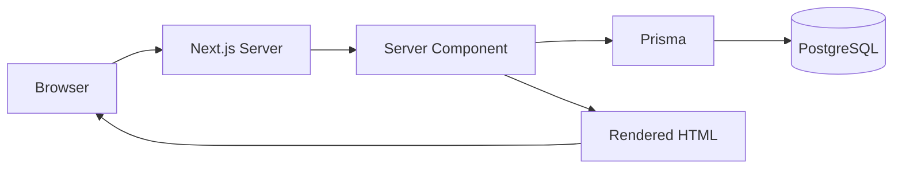
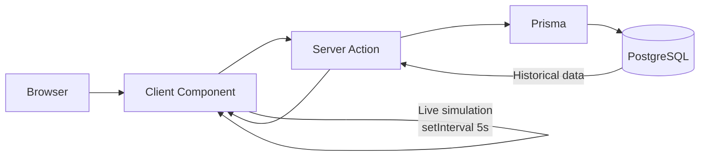
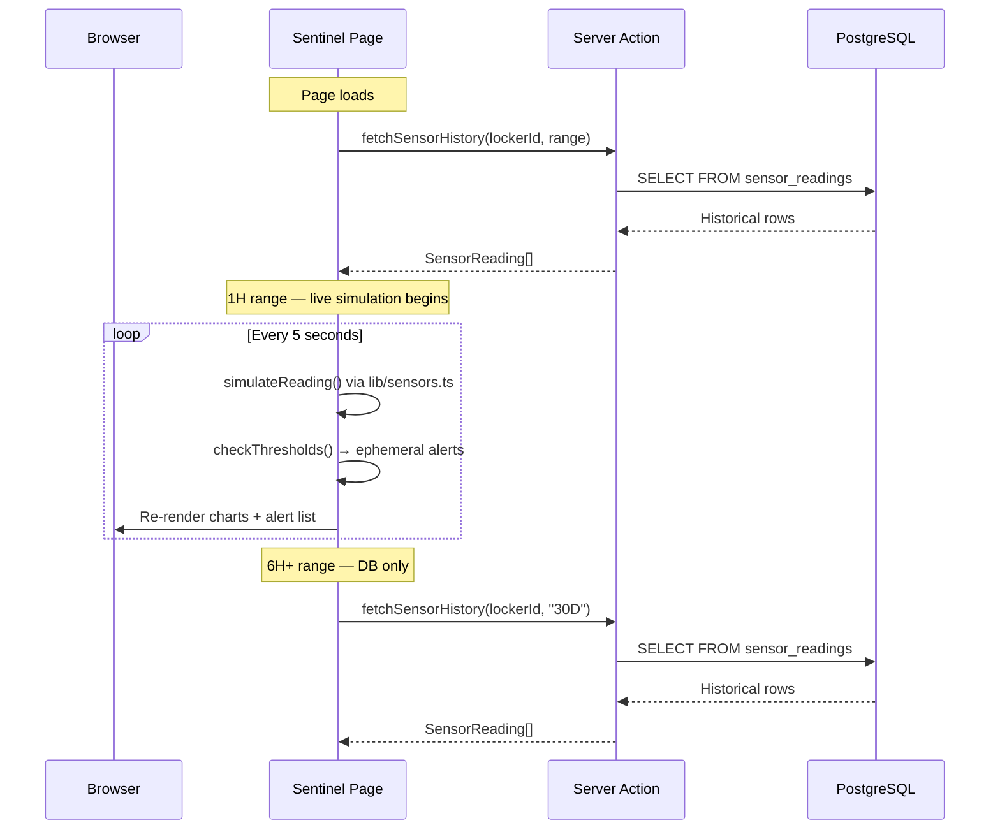
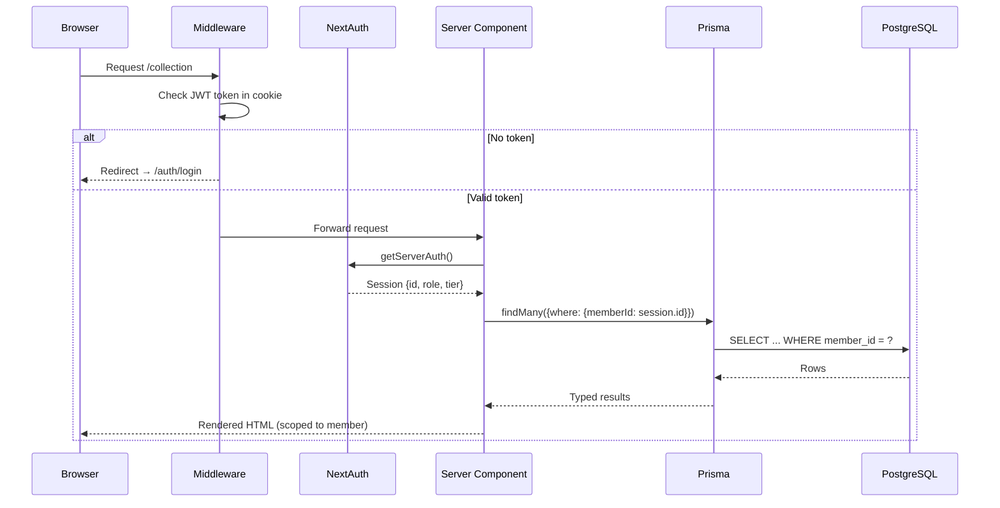

# Architecture

> Last updated: 2026-04-11 | All 14 core features complete

## Overview

Caveau is a **Next.js 14 App Router** application with a **PostgreSQL** backend via **Prisma ORM**. It serves as a luxury wine cellar management demo combining wine inventory, locker visualization, IoT environmental monitoring, and provenance certificates.

## Stack

| Layer | Technology | Purpose |
|-------|-----------|---------|
| Framework | Next.js 14 (App Router) | Full-stack React with SSR/SSG |
| Language | TypeScript | Type safety across the entire stack |
| Styling | Tailwind CSS v3 | Utility-first CSS with custom dark theme |
| Charts | Recharts v2 | Data visualization (sensor charts) |
| Animations | Framer Motion v11 | Page transitions, hover effects, stagger |
| Icons | Lucide React | Tree-shakeable icon library |
| Database | PostgreSQL (AWS RDS) | Relational data store |
| ORM | Prisma 5 | Schema management, type-safe queries, migrations |
| Hosting | Vercel | Zero-config Next.js deploys, CDN, SSL |

## Directory Structure

```
caveau-app/
├── prisma/                     # Database layer
│   ├── schema.prisma           # Data models → generates TypeScript types
│   ├── seed.ts                 # Core seed data
│   └── seed-sensors.ts         # Sensor reading history
├── src/
│   ├── app/                    # Next.js App Router pages
│   │   ├── layout.tsx          # Root layout (fonts, dark bg, metadata)
│   │   ├── globals.css         # Tailwind base + glass-card utilities
│   │   ├── page.tsx            # Dashboard
│   │   ├── collection/page.tsx # Wine inventory
│   │   ├── locker/page.tsx     # Locker visualization
│   │   ├── sentinel/page.tsx   # IoT monitoring
│   │   ├── wine/[id]/page.tsx  # Wine detail
│   │   └── certificate/[id]/   # Provenance certificate
│   ├── components/             # Shared UI components
│   │   ├── nav.tsx             # Sidebar (desktop) + bottom tabs (mobile)
│   │   ├── metric-card.tsx     # Stat card (icon + value + label)
│   │   ├── wine-card.tsx       # Wine card for grid/list views
│   │   ├── locker-grid.tsx     # 4×8 slot grid + detail panel
│   │   ├── sensor-charts.tsx   # Recharts: temp, humidity, vibration, light
│   │   ├── alert-list.tsx      # Alert history table
│   │   ├── certificate-doc.tsx # Certificate layout
│   │   └── add-wine-form.tsx   # Add wine modal
│   └── lib/                    # Shared utilities
│       ├── prisma.ts           # Prisma client singleton
│       ├── utils.ts            # Formatters (currency, date, sensors)
│       └── sensors.ts          # Sensor simulation + threshold checks
├── docs/                       # Developer documentation (you are here)
├── scripts/                    # Build pipeline automation
│   ├── update-status.sh        # Mark features complete in BUILD_STATUS.json
│   ├── update-progress.sh      # Regenerate PROGRESS.md from status
│   └── update-docs.sh          # Regenerate docs from codebase state
└── [config files]              # package.json, tailwind.config.ts, etc.
```

## Data Flow

### Server Components (default)
Most pages are **Server Components** — they run on the server and can query Prisma directly:



Pages using this: Dashboard, Collection, Wine Detail, Certificate, Locker.

### Client Components (interactive)
Pages requiring `setInterval`, event handlers, or browser APIs use **Client Components** with `'use client'`. These cannot call Prisma directly — they fetch data via **Server Actions**:



Pages using this: Sentinel (live sensor updates).

### Sensor Data Flow
The Sentinel page combines two data sources:



1. **Historical** — queried from `sensor_readings` table via Server Action (for 6H+ ranges)
2. **Live** — generated client-side by `lib/sensors.ts` every 5 seconds (for 1H range)

Live alerts are ephemeral (in-memory only, never written to the database).

### Auth Flow



## Key Design Decisions

See [DECISIONS.md](./DECISIONS.md) for the full decision log.

## Rendering Strategy

| Page | Type | Data Source |
|------|------|-------------|
| Dashboard | Server Component | Prisma (aggregates) |
| Collection | Server + Client hybrid | Prisma fetch → client-side filtering |
| Locker | Server + Client hybrid | Prisma fetch → client-side interaction |
| Sentinel | Client Component | Server Actions + live simulation |
| Wine Detail | Server Component | Prisma (single wine) |
| Certificate | Server Component | Prisma (certificate + stats) |
