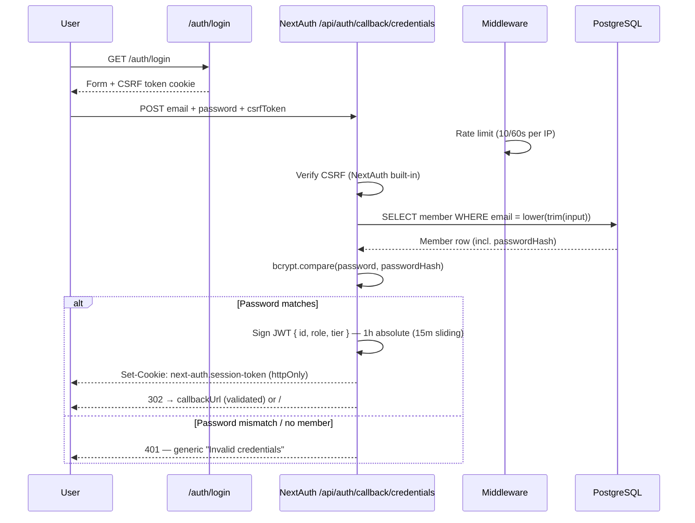
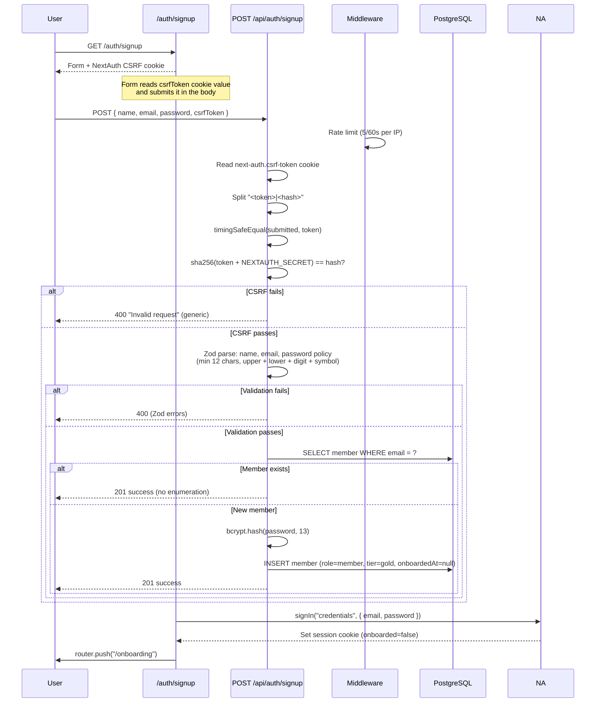
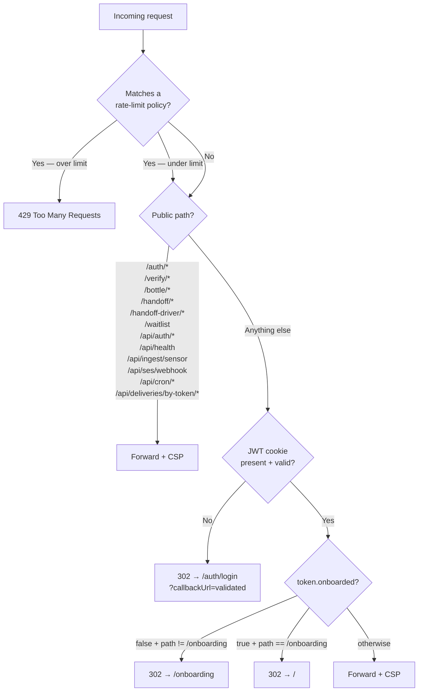
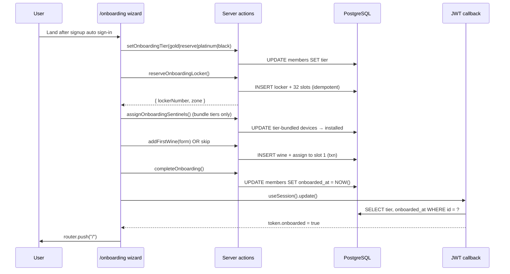

# Authentication

> Last updated: 2026-04-23 | NextAuth v4, JWT sessions, Credentials provider

## Overview

Caveau uses [NextAuth.js v4](https://next-auth.js.org/) with the Credentials provider. Sessions are JWTs, signed with `NEXTAUTH_SECRET` and stored in an httpOnly cookie. There is no refresh token — sessions expire after 1 hour absolute (`maxAge: 3600`) with a 15-minute sliding refresh (`updateAge: 900`), so an active user is not kicked mid-session but an idle tab goes cold quickly.

All application data is scoped to the authenticated member: every Prisma query in a Server Component, Server Action, or API route reads `getServerAuth()` and filters by `memberId`.

## Key files

| File | Purpose |
|------|---------|
| `src/lib/auth.ts` | NextAuth config (Credentials provider, JWT callbacks, `getServerAuth()` helper) |
| `src/middleware.ts` | Edge middleware: rate limits auth endpoints, redirects unauthenticated requests, sets CSP |
| `src/app/api/auth/[...nextauth]/route.ts` | NextAuth handler (login, CSRF, session, signout) |
| `src/app/api/auth/signup/route.ts` | Signup endpoint with CSRF double-submit + Zod validation |
| `src/app/auth/login/page.tsx` | Login form |
| `src/app/auth/signup/page.tsx` | Signup form |
| `src/components/providers.tsx` | `SessionProvider` wrapper for client components |
| `src/types/next-auth.d.ts` | Augments the session type with `id`, `role`, `tier`, `onboarded` |
| `src/lib/safe-callback.ts` | Validates `callbackUrl` to prevent open redirects |
| `src/app/onboarding/` | Guided 4-step wizard for new members (#20, #59) — wizard, server actions, minimal layout |

## Session shape

```ts
session.user = {
  id: string;       // Member.id (UUID)
  name: string;
  email: string;
  role: "admin" | "staff" | "member";
  tier: "gold" | "reserve" | "platinum" | "black";
  onboarded: boolean; // Member.onboardedAt != null
}
```

`role`, `tier`, and `onboarded` are copied into the JWT during the `jwt` callback and surfaced on the session via the `session` callback. RBAC guards are wired and the admin panel (#28) is live at `/admin/*`; middleware gates the route tree to `role === "admin"` with a layout-level re-check.

The `jwt` callback also handles `trigger === "update"`: when the onboarding wizard finishes it calls `useSession().update()`, which re-runs the callback and re-reads `tier` + `onboardedAt` from the DB so middleware sees the new state without forcing a re-login.

## Login flow



**Hardening notes**
- Email is lowercased and trimmed before lookup.
- bcrypt cost on signup hashing is 13 — high enough to slow down offline cracking, low enough to fit in the 5s serverless budget. Login uses `bcrypt.compare`, which has no cost parameter.
- The `callbackUrl` query param is validated by `safe-callback.ts` so it can only point to same-origin paths.

## Signup flow



**Why the double-submit CSRF check**
NextAuth's CSRF cookie is a `<token>|<hash>` pair where `hash = sha256(token + NEXTAUTH_SECRET)`. By requiring the client to echo the token back in the request body and verifying both halves, we prove the request originated from a page that read our cookie — a cross-origin attacker cannot read the cookie value, so they cannot forge a valid body.

**Why 201 for both new and existing accounts**
Returning `409 Conflict` for an existing email would let an attacker enumerate which addresses are registered. The bcrypt cost difference is a small timing side channel we accept for now.

## Route protection



Public paths bypass auth entirely. The public tree has grown since the original demo — NFC tap-to-verify at `/bottle/:tagId` (#43), auction-broker handoff at `/handoff/:token` (#41), delivery driver portal at `/handoff-driver/:token` (#51), the founding-member waitlist page and POST endpoint (#49), the public Sentinel ingest route (#21, guarded by `SENTINEL_INGEST_SECRET` bearer instead of session), the SES bounce/complaint webhook (#19, SNS-signed), cron endpoints (`/api/cron/*`, guarded by `CRON_SECRET` bearer), and the delivery by-token API for drivers (`/api/deliveries/by-token/*`). Everything else — including `/report/*` and the legacy `/certificate/*` redirect — requires a valid session cookie. The report **page** then performs an ownership check (`session.user.id == certificate.wine.memberId`) before rendering, and the `/api/certificates/[id]` route applies the same guard. Admin routes (`/admin/*`) additionally require `role === "admin"` in middleware with a layout-level re-check.

The onboarding gate runs after the auth check: members whose `onboardedAt` is null are pinned to `/onboarding` until the wizard finishes, and members who have already finished are redirected away if they revisit the wizard URL. This is enforced in middleware against the JWT, not against the database, so the gate is effectively free per request.

## Onboarding wizard (#20)

After signup the client auto-signs in and pushes the new member to `/onboarding`. The wizard is a single client component (`src/app/onboarding/wizard.tsx`) that drives four steps via local state:

1. **Tier** — pick gold / reserve / platinum / black (display-labelled Collector / Reserve / Private Vault / Estate). `setOnboardingTier(tier)` server action persists the choice. The signup endpoint defaults new members to gold so this step is a re-confirmation, not a hard requirement.
2. **Locker reservation** — `reserveOnboardingLocker()` allocates the next free `locker_number`, creates the row in the demo facility, and creates 32 `LockerSlot` rows in a single Prisma call. Idempotent: a member who already owns a locker gets that one returned. Number collisions under contention bubble up as Prisma `P2002` and the action retries with a bumped number (up to three attempts).
3. **Sentinel devices (#59)** — for bundle tiers (Reserve / Private Vault / Estate) `assignOnboardingSentinels()` consumes the oldest pool units at the member's facility and transactionally flips them to installed in step 2's reserved locker with a demo-alive heartbeat (connectivity=wifi, batteryPct=100, lastHeartbeatAt=now). Shortage soft-fails with "N shipping this week" copy. Collector is an upsell panel with no server action.
4. **First bottle** — optional. `addFirstWine(formData)` validates the inputs, creates a `Wine`, and assigns it to the first empty slot of the reserved locker inside a single transaction. The user can also skip the bottle and finish.

Both terminal paths call `completeOnboarding()`, which sets `members.onboarded_at = NOW()`. The client then calls `useSession().update()`. That triggers the `jwt` callback with `trigger === "update"`, which re-reads the member row and refreshes `token.onboarded` → middleware lets the member into `/`.

**Resume support** — the page server component reads the member row before rendering. If a previous attempt already reserved a locker, the wizard mounts at step 3 (devices) instead of step 1 so the user doesn't have to pick a tier or re-reserve a locker after a refresh.



## Rate-limit policies

| Bucket | Trigger | Limit |
|--------|---------|-------|
| `auth-signup` | `POST /api/auth/signup` | 5 / 60s per IP (fail-closed) |
| `auth-login` | `POST /api/auth/callback/*` | 10 / 60s per IP (fail-closed) |
| `verify` | Any `/verify/*` request | 20 / 60s per IP |
| `sensors-history` | `GET /api/sensors/history` | 30 / 60s per IP |
| `handoff` | Any `/handoff/*` request (#41) | 30 / 60s per IP |
| `handoff-driver` | Any `/handoff-driver/*` request (#51) | 30 / 60s per IP |
| `bottle-tap` | Any `/bottle/*` request (#43) | 30 / 60s per IP |
| `waitlist-submit` | `POST /waitlist` (#49) | 5 / 60s per IP |

Limiter backend is Upstash Redis when `UPSTASH_REDIS_REST_URL` + `UPSTASH_REDIS_REST_TOKEN` are set; otherwise `src/lib/rate-limit.ts` falls back to per-Lambda in-memory tracking that resets on cold start (adequate for dev, not a real ceiling in prod). Signup and login are configured `failMode: "closed"` — if Upstash is unreachable we reject rather than silently disable brute-force protection.

## Server-side vs client-side access

- **Server Components, Server Actions, Route Handlers** — call `getServerAuth()` from `src/lib/auth.ts`. Always check the result is non-null before querying user data.
- **Client Components** — call `useSession()` from `next-auth/react`. The whole tree is wrapped in `<SessionProvider>` via `components/providers.tsx`.

## Demo credentials

When enabled, the login page surfaces:

```
robert@caveau.com / demo1234
```

This block is gated by `process.env.NEXT_PUBLIC_SHOW_DEMO_CREDS === "true"`, which is bundled at build time so the check strips to a constant in production bundles when the flag is unset. Leave the env var unset in production deployments; set it to `"true"` in dev or staging builds where demo credentials should be visible.

## Known gaps

- No email verification on signup — the address is trusted as soon as it parses.
- No password reset flow.
- No account lockout after N failed login attempts (rate limit is per IP, not per account).
- When Upstash is not configured the rate limiter falls back to per-Lambda memory; an attacker can spread attempts across cold starts. Wire Upstash in prod.
- Role downgrades (admin → member) invalidate existing sessions by bumping `Member.sessionVersion` (migration 0020), checked in the `jwt` callback. Role upgrades still require a relogin until the sliding-refresh window repulls the row.
