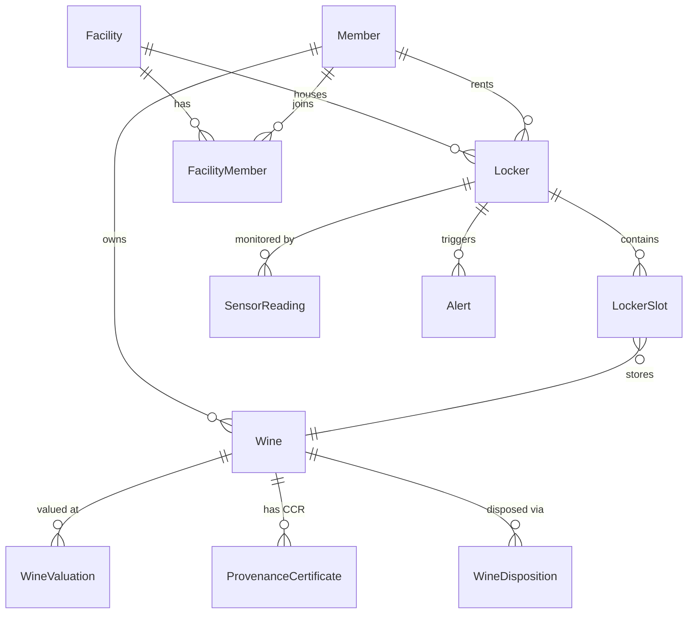

# Data Model

> Last updated: 2026-04-23 | 36 Prisma models, 31 Postgres enums, 39 SQL migrations (0001..0039). Source of truth: `prisma/schema.prisma`.

## Principles

- **Member-scoped data.** Nearly every row ultimately attaches to `Member` (`memberId`) and is enforced via `getServerAuth()` scoping in Server Components/Actions and API routes.
- **Multi-facility by join table.** Members can belong to multiple facilities via `FacilityMember`; the facility switcher writes a signed cookie and the server reads it to scope facility-specific queries.
- **Audit-first workflows.** Dispositions, deliveries, handoff access, and NFC scans are modeled as append-only logs; foreign keys use `Restrict` where deleting the parent would erase history.
- **Decimals everywhere.** Money and sensor columns are `Decimal` — always convert before arithmetic (see “Prisma Decimal Fields” below).

## Core entities (inventory, storage, monitoring)

This diagram intentionally omits many Phase 4–6 tables to stay readable.

## Phase 4–6 workflows (high level)

### Vault + provenance

- `LivexBenchmark` — Liv-ex Fine Wine 100 snapshots used for portfolio benchmarking (#39/#57).
- `ExitSignal` — drink-window + price-momentum flags that drive the sell-window narrative (#55).
- `ExitFacilitation` — member-initiated consignment with staff listing + sale close (#47).
- `HandoffPackage` + `HandoffAccess` — tokenized auction/broker bundles with access logging (#41).
- `NfcTag` + `NfcScan` — per-bottle NFC registry + scan log for the public `/bottle/[tagId]` landing (#43).
- `ProvenanceCertificate` — Caveau Custody & Condition Report (CCR) record and integrity hash (#30/#40).

### Sentinel fleet (devices + readings)

- `SentinelDevice` + `SentinelDeviceEvent` — device registry with install/firmware/event log (#58/#59).
- `SensorReading.deviceId` is nullable so historical readings (pre-fleet) don’t need backfill; it becomes important once Bottle Probes exist alongside locker sensors.

### Member programs

- `DeliveryRequest` + `DeliveryRequestItem` + `DeliveryEvent` + `AuthorizedRecipient` — Deliver Now ladder + door-side ID match (#51).
- `HurricaneProtocol` + `HurricaneProtocolMember` — activation state machine + per-member enrollment (#46).
- `Waitlist` — founding-member waitlist lead capture (#49).

### Growth + operations

- `Event` + `EventRsvp` + `EventSignup` — events/tastings with member RSVPs and public signups (#53).
- `MigrationRequest` — concierge CSV import request + fulfillment bookkeeping (#52).

### Revenue modules

- `Allocation` + `AllocationRequest` — private allocations feed; fulfillment writes `Wine.sourceAllocationId` (#60).
- `Appraisal` — point-in-time valuation document distinct from the CCR; public verify uses `dataIntegrityHash` (#61).
- `Acquisition` — member-requested bottle sourcing; fulfillment writes `Wine.sourceAcquisitionId` (#62).

## Enums

Enums are real Postgres enum types (not free-form strings). Values below mirror `prisma/schema.prisma`.

| Enum | Values |
|------|--------|
| `Role` | `admin`, `staff`, `member` |
| `Tier` | `gold`, `reserve`, `platinum`, `black` |
| `AlertType` | `temperature`, `humidity`, `vibration`, `light`, `door`, `access` |
| `Severity` | `info`, `warning`, `critical` |
| `WineStatus` | `in_cellar`, `sold`, `transferred`, `consumed`, `gifted`, `removed` |
| `DispositionType` | `sold`, `transferred`, `consumed`, `gifted`, `removed` |
| `FacilityEventType` | `weather`, `hurricane`, `generator_test`, `inspection`, `incident` |
| `HandoffChannel` | `auction`, `broker`, `private` |
| `NfcTagTier` | `capsule`, `collar` |
| `HurricaneStage` | `watch_issued`, `transport_dispatched`, `sheltered`, `all_clear`, `returned`, `cancelled` |
| `AlertSource` | `device`, `simulation` |
| `DeliveryStatus` | `requested`, `pin_entered`, `address_confirmed`, `otp_verified`, `handoff_started`, `id_scanned`, `completed`, `cancelled`, `expired` |
| `DeliveryEventActor` | `member`, `staff`, `system` |
| `DeliveryEventType` | `requested`, `biometric_verified`, `pin_entered`, `pin_failed`, `address_confirmed`, `otp_sent`, `otp_verified`, `otp_failed`, `handoff_started`, `id_scanned`, `photo_captured`, `completed`, `cancelled`, `expired` |
| `EventStatus` | `draft`, `published`, `cancelled` |
| `MigrationSource` | `cellartracker`, `vivino`, `other` |
| `MigrationStatus` | `submitted`, `fulfilled`, `failed`, `cancelled` |
| `ExitSignalReason` | `drink_window_closing`, `peak_momentum`, `dual` |
| `ExitSignalStrength` | `moderate`, `strong` |
| `SentinelModel` | `sentinel_locker`, `bottle_probe` |
| `SentinelConnectivity` | `wifi`, `lte_m`, `offline` |
| `SentinelEventType` | `installed`, `firmware_updated`, `reassigned`, `retired`, `heartbeat_gap`, `battery_low`, `connectivity_changed`, `test_ping` |
| `ExitStatus` | `requested`, `listed`, `sold`, `withdrawn`, `cancelled` |
| `ExitChannel` | `auction`, `broker`, `private_sale`, `self_handled` |
| `AllocationStatus` | `draft`, `published`, `closed`, `fulfilled`, `cancelled` |
| `AllocationRequestStatus` | `submitted`, `accepted`, `declined`, `cancelled`, `fulfilled` |
| `AppraisalStatus` | `submitted`, `in_progress`, `completed`, `cancelled` |
| `AppraisalBasis` | `fair_market_value`, `retail_replacement`, `auction_estimate` |
| `AppraisalPurpose` | `insurance`, `estate`, `tax_donation`, `divorce`, `gift`, `personal` |
| `AcquisitionStatus` | `requested`, `sourcing`, `fulfilled`, `declined`, `cancelled` |
| `AcquisitionSource` | `livex`, `broker`, `auction`, `caveau_private` |

## Notable constraints and delete behavior

- **`FacilityMember`** is a composite primary key `(memberId, facilityId)` — membership existence is the signal.
- **`LockerSlot`** has `@@unique([lockerId, slotPosition])` and `@@unique([wineId])` so a bottle can only sit in one slot at a time.
- **`WineValuation`** has `@@unique([wineId, date, source])` to prevent duplicate price points.
- **`SensorReading`** has `@@unique([lockerId, timestamp])` to make ingest idempotent.
- **Audit preservation:** `WineDisposition.wine` and `DeliveryRequestItem.wine` use `onDelete: Restrict` so you can’t delete a wine that has an outbound-history trail.

## Prisma Decimal Fields

Prisma returns `Decimal` columns as `Prisma.Decimal` objects (string-backed), **not native JS numbers**. This affects:

- `Wine.purchasePrice`, `Wine.currentValue`
- `WineValuation.price`
- `WineDisposition.salePrice`
- `SensorReading.temperature`, `humidity`, `vibration`, `lightLux`
- Many finance fields in Phase 5–6 tables (appraisals, acquisitions, exits)

Always convert before arithmetic — use `toNumber()` from `src/lib/utils.ts` (accepts `Decimal | string | number | null | undefined`).

