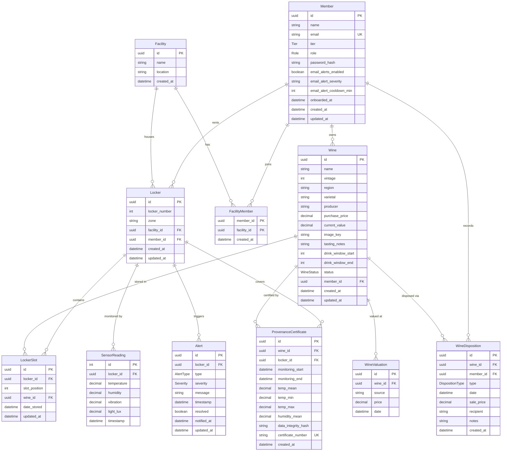

# Data Model

> Last updated: 2026-04-13 | 14 core + 3 stretch features complete; 14 of 24 roadmap features done

## Entity Relationship Diagram

## Enums

All enums below are real Postgres enum types (not string columns):

| Enum | Values |
|------|--------|
| `Role` | `admin`, `staff`, `member` |
| `Tier` | `gold`, `platinum`, `black` |
| `AlertType` | `temperature`, `humidity`, `vibration`, `light`, `door`, `access` |
| `Severity` | `info`, `warning`, `critical` |
| `WineStatus` | `in_cellar`, `sold`, `transferred`, `consumed`, `gifted`, `removed` |
| `DispositionType` | `sold`, `transferred`, `consumed`, `gifted`, `removed` |

## Entity Descriptions

> Seed data quantities below describe the demo data seeded by `prisma/seed.ts`.

### Facility
Physical wine storage location. Demo seeds one facility ("Caveau Naples", Naples, FL). Multi-location expansion (#16) uses the `FacilityMember` join table so members can belong to multiple facilities.

### FacilityMember
Join table for `Member ↔ Facility` (feature #16). Composite PK `(memberId, facilityId)`; both FKs cascade on delete. Holds no other state — membership existence is the signal.

### Member
A Caveau member. `role: Role` enables RBAC (admin panel #28 not yet built). `tier: Tier` is a real enum. `passwordHash` is optional only because legacy seed users may not have one — NextAuth rejects logins without it. Email alert preferences (`emailAlertsEnabled`, `emailAlertSeverity`, `emailAlertCooldownMin`) drive feature #19 SES delivery. `onboardedAt` gates the `/onboarding` wizard (#20) — null means the wizard has not been completed. Demo seeds one user ("Robert Saenz", black tier, role: `member`).

### Wine
A bottle in a member's collection. `memberId` is **non-nullable** and uses `onDelete: Restrict` — disposition history keeps wines from being silently deleted. `imageKey` stores the S3 object key from feature #18; the full URL is derived at read time via `getPublicUrl(imageKey)` so CDN domains can change without rewriting rows. `status: WineStatus` tracks whether the wine is in the cellar or has been disposed. Seeds 66 wines across 8 categories: Caveau private label (5), investment-grade (8), mid-range (12), French classics (10), Italian icons (10), Spanish/Portuguese (6), New World gems (10), and Champagne (5).

### WineValuation
Price history for a wine. Unique `(wineId, date, source)` prevents duplicate entries from imports. Seeds 4-6 entries per wine (329 total) with sources: `manual`, `liv-ex`, `wine-searcher`, `auction` over 12 months. Powers the dashboard analytics collection value trend chart.

### Locker
A physical wine locker. `facilityId` is **non-nullable** with `onDelete: Restrict`. Uniqueness is `(facilityId, lockerNumber)` — locker numbers are scoped per facility, not globally, so two facilities can both have a Locker #7. Each has 32 slots (4 columns × 8 rows). Demo seeds 4 lockers in the Caveau Naples facility: #7 (Zone A), #12 (Zone B), #19 (Zone C), #24 (Zone D).

### LockerSlot
A position within a locker. The `(lockerId, slotPosition)` unique constraint prevents double-booking. Seeds 66 of 128 total slots as occupied.

### SensorReading
Environmental data from a locker's Sentinel sensor. Uses **autoincrement** `Int` IDs (not UUID) for write performance at scale. Seeds ~34K rows (30 days at 5-minute intervals for 4 lockers). Live simulation readings from the Sentinel page are **not** written here — only seeded/historical data lives in this table.

### Alert
A threshold breach or access event. `type: AlertType` and `severity: Severity` are real enums. `notifiedAt` tracks when a SES notification was last delivered for feature #19's cooldown logic. Live alerts from the Sentinel page are in-memory only — they are not written to this table. Seeds 20 historical alerts.

### ProvenanceCertificate
A document certifying storage conditions for a wine. Includes aggregated sensor stats (temp mean/min/max, humidity mean) and a SHA-256 `dataIntegrityHash` over the pipe-joined sensor reading IDs in the monitoring window.

### WineDisposition
Audit trail for wines leaving the collection. `type: DispositionType` is one of: `sold`, `transferred`, `consumed`, `gifted`, `removed`. The wine FK uses `onDelete: Restrict` — a wine cannot be deleted while it has disposition records. The member FK uses `onDelete: Cascade` because a deleted member's audit records have no meaningful owner. Unique `(wineId, type, date)` prevents duplicate entries. Optional `salePrice` (for sold), `recipient` (for transferred/gifted), and `notes` fields.

## Important: Prisma Decimal Fields

Prisma returns `Decimal` columns as `Prisma.Decimal` objects (string-backed), **not native JS numbers**. This affects:

- `Wine.purchasePrice`, `Wine.currentValue` (both `Decimal(14,2)`)
- `WineValuation.price` (`Decimal(14,2)`)
- `WineDisposition.salePrice` (`Decimal(14,2)`)
- All `SensorReading` fields (temperature, humidity, vibration, lightLux)
- `ProvenanceCertificate` temp/humidity fields

**Always** use `Number()` or `.toNumber()` before doing arithmetic. The `toNumber()` helper in `src/lib/utils.ts` handles all cases (Decimal, string, number, null).

## Indexes

| Table | Index | Purpose |
|-------|-------|---------|
| facility_members | facility_id | Member lookup per facility |
| members | tier | Tier filtering (low-cardinality; flagged for removal in audit) |
| members | role | Role filtering (low-cardinality; flagged for removal in audit) |
| wines | member_id | Filter wines by member |
| wines | member_id, region, varietal | Compound filter for collection |
| wines | member_id, status | Active vs disposed wines |
| wines | member_id, status, current_value DESC | Top-value wines per member |
| wine_valuations | wine_id, date, source (unique) | Prevent duplicate valuations |
| wine_valuations | wine_id, date DESC | Latest valuation per wine |
| lockers | facility_id, locker_number (unique) | Per-facility locker numbering |
| lockers | member_id | Lockers by member |
| locker_slots | locker_id, slot_position (unique) | Prevent double-booking |
| locker_slots | wine_id | Wine-to-slot lookup |
| sensor_readings | locker_id, timestamp DESC | Recent readings per locker |
| alerts | locker_id, timestamp DESC | Recent alerts per locker |
| alerts | resolved, locker_id, timestamp DESC | Unresolved alert queries |
| alerts | locker_id, type, resolved, notified_at DESC | SES notification cooldown lookups |
| wine_dispositions | wine_id, type, date (unique) | Prevent duplicate dispositions |
| wine_dispositions | wine_id | Disposition history lookup |
| wine_dispositions | member_id | Member disposition history |
| provenance_certificates | wine_id, locker_id | Certificate lookup |
