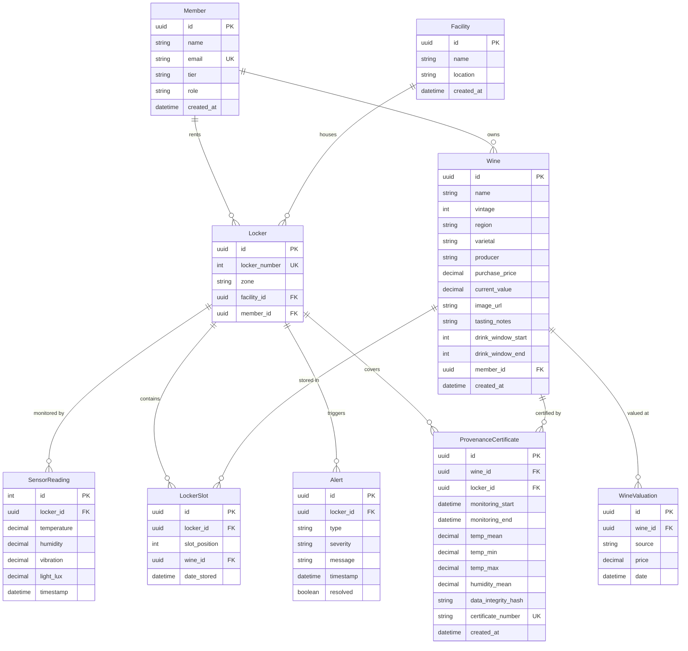

# Data Model

> Last updated: 2026-04-10 18:52 | Feature 01 — Project Scaffold

## Entity Relationship Diagram

## Entity Descriptions

### Facility
Physical wine storage location. Demo seeds one facility ("Caveau Naples"). Included to support multi-location expansion post-demo.

### Member
A Caveau member. Demo uses one hardcoded user ("Alessandro Marchetti", Black tier). The `role` field (`admin` | `staff` | `member`) is seeded as `member` — it enables RBAC when auth is added.

### Wine
A bottle in a member's collection. 35 wines are seeded across 4 categories: Caveau private label (5), investment-grade (8), mid-range (12), and French classics (10).

### WineValuation
Price history for a wine. Demo seeds one entry per wine (source: "manual"). Designed for future Liv-ex/Wine-Searcher API integration.

### Locker
A physical wine locker assigned to a facility and member. Demo seeds 2 lockers (#7 Zone A, #12 Zone B). Each has 32 slots (4 columns × 8 rows).

### LockerSlot
A position within a locker. 24 of 64 total slots are occupied in the demo. The `[lockerId, slotPosition]` unique constraint prevents double-booking.

### SensorReading
Environmental data from a locker's Sentinel sensor. Uses **autoincrement** IDs (not UUID) for write performance at scale. The seed script generates ~17K rows (30 days at 5-minute intervals for 2 lockers).

### Alert
A threshold breach event. 8 historical alerts are seeded. Live alerts from the Sentinel page are in-memory only — they are not written to this table.

### ProvenanceCertificate
A document certifying storage conditions for a wine. Includes aggregated sensor stats (temp mean/min/max, humidity mean) and a SHA-256 data integrity hash of the sensor readings in the monitoring window.

## Important: Prisma Decimal Fields

Prisma returns `Decimal` columns as `Prisma.Decimal` objects (string-backed), **not native JS numbers**. This affects:

- `Wine.purchasePrice`, `Wine.currentValue`
- `WineValuation.price`
- All `SensorReading` fields (temperature, humidity, vibration, lightLux)
- `ProvenanceCertificate` temp/humidity fields

**Always** use `Number()` or `.toNumber()` before doing arithmetic. The `toNumber()` helper in `src/lib/utils.ts` handles all cases (Decimal, string, number, null).

## Indexes

| Table | Index | Purpose |
|-------|-------|---------|
| wines | member_id | Filter wines by member |
| wine_valuations | wine_id, date DESC | Latest valuation per wine |
| lockers | facility_id | Lockers by facility |
| lockers | member_id | Lockers by member |
| locker_slots | locker_id + slot_position (unique) | Prevent double-booking |
| sensor_readings | locker_id, timestamp DESC | Recent readings per locker |
| sensor_readings | timestamp DESC | Global recent readings |
| alerts | locker_id, timestamp DESC | Recent alerts per locker |
| alerts | resolved, locker_id | Unresolved alert queries |
