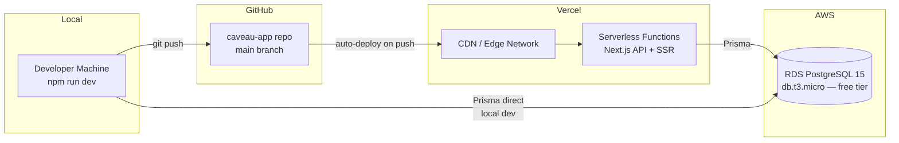

# Deployment

> Last updated: 2026-04-23 | Phase 6 complete; 40 of 47 post-demo roadmap features done (excluding #33)

## Infrastructure



| Service | Purpose | Tier |
|---------|---------|------|
| AWS RDS (PostgreSQL 15) | Database | Free tier: db.t3.micro, 20GB |
| Vercel | Hosting + CDN | Free tier: 100GB bandwidth, serverless functions |
| GitHub | Source control | Free |

## RDS Setup

### 1. Create the database instance

1. AWS Console → RDS → Create database
2. Engine: **PostgreSQL 15**
3. Template: **Free tier** (db.t3.micro, 20GB gp2)
4. DB instance identifier: `caveau-db`
5. Master username/password: your choice
6. **Public access: Yes** (required for local dev + Vercel)
7. Create database name: `caveau`

### 2. Configure security group

Add inbound rules for port **5432 (PostgreSQL)**:

| Source | Purpose |
|--------|---------|
| Your IP (e.g., `73.x.x.x/32`) | Local development |

**Do NOT use `0.0.0.0/0`** — it exposes the database to the entire internet.

**Note on Vercel access:** Vercel serverless functions use dynamic IPs that change per invocation. For the demo/early production phase, RDS public access with strong credentials and SSL is sufficient. For hardened production, consider RDS Proxy or a VPN.

### 3. Get connection string

Copy the RDS endpoint from the console. Your `DATABASE_URL` will be:
```
postgresql://<username>:<password>@<endpoint>.rds.amazonaws.com:5432/caveau
```

**Production note:** in Vercel, append `?connection_limit=5&pool_timeout=10` so each Lambda caps its Prisma pool and can't exhaust the RDS connection budget on a traffic spike. Migrate to RDS Proxy once steady-state traffic justifies it.

### 4. Initialize the database

```bash
# Push schema to RDS
npx prisma migrate deploy

# Seed demo data
npx prisma db seed
```

## Vercel Setup

### 1. Connect repository

1. Go to [vercel.com](https://vercel.com) → New Project → Import GitHub repo
2. Select the `caveau-app` repository
3. Vercel auto-detects Next.js — zero configuration needed

### 2. Configure environment variables

Add in Vercel Dashboard → Settings → Environment Variables. **Only two vars are required** — `src/lib/env.ts` throws at boot if either is missing:

| Key | Required | Value |
|-----|----------|-------|
| `DATABASE_URL` | Yes | Your RDS connection string |
| `NEXTAUTH_SECRET` | Yes | JWT signing secret — generate with `openssl rand -base64 32` |
| `NEXTAUTH_URL` | No | Public app URL (e.g. `https://caveau.vercel.app`). Vercel sets `VERCEL_URL` automatically; NextAuth falls back to it if `NEXTAUTH_URL` is unset. Set it explicitly when you attach a custom domain. |
| `NEXT_PUBLIC_SHOW_DEMO_CREDS` | No | When `"true"`, the login page renders the `robert@caveau.com / demo1234` block. Leave unset in production. |
| `CERTIFICATE_HMAC_SECRET` | No | Independent HMAC key for Caveau Custody & Condition Report hashes (`src/lib/certificate-hash.ts`). Falls back to `NEXTAUTH_SECRET` if unset — fine for the demo; set a dedicated random value in real production so a leak of one secret doesn't compromise the other. |
| `FACILITY_COOKIE_SECRET` | No | Independent HMAC key for the signed facility-switcher cookie (`src/lib/current-facility.ts`). Same fallback story as above. |
| `UPSTASH_REDIS_REST_URL` | No | Enables distributed rate limiting. Without it, `src/lib/rate-limit.ts` uses the per-Lambda in-memory limiter, which resets on cold start. |
| `UPSTASH_REDIS_REST_TOKEN` | No | Companion token for Upstash Redis. Both must be set for the Redis limiter to activate. |
| `AWS_REGION` | No | AWS region for SES + S3 clients (e.g. `us-east-1`) |
| `AWS_SES_FROM_EMAIL` | No | Enables feature #19 alert emails. If unset, the app logs + no-ops instead of calling SES. |
| `AWS_S3_BUCKET` | No | Enables feature #18 wine image upload. If unset, the upload UI shows a friendly "disabled" state and the rest of the app keeps working. |
| `AWS_CLOUDFRONT_DOMAIN` | No | When set, public image URLs go through the CDN instead of S3 directly. |
| `GOOGLE_CLOUD_VISION_API_KEY` | No | Enables wine label OCR (feature #24). If unset, the Scan Label button renders disabled with a tooltip. Restrict the key to the Vision API only in Google Cloud Console. |
| `S3_UPLOAD_URL_TTL_SECONDS` | No | Presigned upload URL TTL. Defaults to `300`, clamped to `[60, 900]` in `src/lib/env.ts`. |
| `LIVEX_API_KEY` | No | Enables live Liv-ex price sync (feature #39). When unset, `/api/cron/livex-sync` no-ops and seeded `WineValuation` data renders unchanged. |
| `LIVEX_BASE_URL` | No | Override the Liv-ex API base URL (sandbox or non-default endpoint). |
| `CRON_SECRET` | No | Shared Bearer token that guards `/api/cron/*` in production. Vercel Cron sends it automatically when set in the project env. Dev requests are allowed when unset. |
| `SENTINEL_INGEST_SECRET` | No | Shared Bearer token that guards `/api/ingest/sensor` (feature #21). Devices send `Authorization: Bearer <secret>`. Staging and production **must** set this or every request returns 401. |
| `ANTHROPIC_API_KEY` | No | Enables the AI Advisor chat route (feature #50). When unset, `/api/advisor/chat` returns 503 `{ error: "advisor_not_configured" }`. |
| `SENTRY_DSN` | No | Error tracking. When unset, the app runs without Sentry instrumentation. |

The AWS, Google, Upstash, Liv-ex, Sentinel, and Anthropic vars all degrade gracefully — the app boots and runs without them; the corresponding features just become no-ops or disabled UI.

### 3. Scheduled cron jobs (`vercel.json`)

Two cron jobs are declared in `vercel.json` and execute via Vercel Cron:

| Schedule | Route | Purpose |
|---------|-------|---------|
| `0 9 * * *` (daily 09:00 UTC) | `/api/cron/livex-sync` | Refreshes `WineValuation` rows from Liv-ex (feature #39). No-ops if `LIVEX_API_KEY` is unset. |
| `0 3 * * *` (daily 03:00 UTC) | `/api/cron/sensor-retention` | Deletes raw `SensorReading` rows older than 90 days. Interim retention policy until full partitioning + rollups (#22). |

Both routes are guarded by `CRON_SECRET` in production via timing-safe Bearer comparison. In development they are reachable without auth so local testing doesn't need extra wiring.

### 4. SES webhook (feature #19)

When SES is live the operator must subscribe an SNS topic to `https://<host>/api/ses/webhook` and attach Bounce + Complaint event destinations on the SES Configuration Set / Identity. Without this wiring, hard-bounced and complaining members silently keep failing to receive alerts because SES drops them.

### 5. Deploy

Push to `main` → Vercel auto-deploys. Preview deployments are created for every PR.

### 6. Custom domain (optional)

Add via Vercel Dashboard → Settings → Domains.

## Security Middleware

The app's `src/middleware.ts` applies security controls to every request:

- **Auth protection**: all routes require a valid JWT, with these exceptions: `/auth/*`, `/verify/*`, `/bottle/*` (#43), `/handoff/*` (#41), `/handoff-driver/*` (#51), `/waitlist` (#49), `/api/auth/*`, `/api/health`, `/api/ingest/sensor` (bearer-guarded, #21), `/api/ses/webhook` (SNS-signed, #19), `/api/cron/*` (bearer-guarded), and `/api/deliveries/by-token/*` (driver-facing). `/report/*` pages are auth-protected and enforce an ownership check before rendering. `/admin/*` additionally requires `role === "admin"`.
- **Rate limiting** (per-IP): signup 5/60s fail-closed, login 10/60s fail-closed, `/verify/*` 20/60s, `/handoff/*` 30/60s, `/handoff-driver/*` 30/60s, `/bottle/*` 30/60s, `/waitlist` POST 5/60s, `/events/*` POST 5/60s, `/api/sensors/history` 30/60s. Upstash Redis backend when configured; in-memory fallback otherwise.
- **CSP headers**: Content-Security-Policy is built per-request. Production uses `'unsafe-inline'` for scripts due to Next.js App Router limitations (inline scripts without nonce support). `connect-src` is derived from `AWS_S3_BUCKET` + `AWS_CLOUDFRONT_DOMAIN` at request time so the policy never wildcards `*.amazonaws.com`.
- **Static security headers** (in `next.config.mjs`): HSTS (2 years + preload), X-Frame-Options DENY, X-Content-Type-Options nosniff, Permissions-Policy (no camera/mic/geo), X-Permitted-Cross-Domain-Policies none.

## Troubleshooting

### Build fails with Prisma errors
Ensure `prisma generate` runs during the build. Add a `postinstall` script to package.json:
```json
"postinstall": "prisma generate"
```

### Database connection timeouts
The Prisma client singleton in `src/lib/prisma.ts` prevents re-initialization on warm serverless invocations. If you see connection exhaustion under load, consider adding RDS Proxy (~$22/mo) for connection pooling.

### Slow cold starts
Vercel serverless functions can have cold starts on first request. Subsequent requests reuse the warm function and existing database connection.
