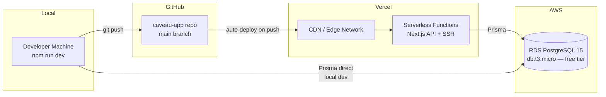

# Deployment

> Last updated: 2026-04-11

## Infrastructure



| Service | Purpose | Tier |
|---------|---------|------|
| AWS RDS (PostgreSQL 15) | Database | Free tier: db.t3.micro, 20GB |
| Vercel | Hosting + CDN | Free tier: 100GB bandwidth, serverless functions |
| GitHub | Source control | Free |

## RDS Setup

### 1. Create the database instance

1. AWS Console → RDS → Create database
2. Engine: **PostgreSQL 15**
3. Template: **Free tier** (db.t3.micro, 20GB gp2)
4. DB instance identifier: `caveau-db`
5. Master username/password: your choice
6. **Public access: Yes** (required for local dev + Vercel)
7. Create database name: `caveau`

### 2. Configure security group

Add inbound rules for port **5432 (PostgreSQL)**:

| Source | Purpose |
|--------|---------|
| Your IP (e.g., `73.x.x.x/32`) | Local development |

**Do NOT use `0.0.0.0/0`** — it exposes the database to the entire internet.

**Note on Vercel access:** Vercel serverless functions use dynamic IPs that change per invocation. For the demo/early production phase, RDS public access with strong credentials and SSL is sufficient. For hardened production, consider RDS Proxy or a VPN.

### 3. Get connection string

Copy the RDS endpoint from the console. Your `DATABASE_URL` will be:
```
postgresql://<username>:<password>@<endpoint>.rds.amazonaws.com:5432/caveau
```

### 4. Initialize the database

```bash
# Push schema to RDS
npx prisma migrate deploy

# Seed demo data
npx prisma db seed
```

## Vercel Setup

### 1. Connect repository

1. Go to [vercel.com](https://vercel.com) → New Project → Import GitHub repo
2. Select the `caveau-app` repository
3. Vercel auto-detects Next.js — zero configuration needed

### 2. Configure environment variables

Add in Vercel Dashboard → Settings → Environment Variables:

| Key | Value |
|-----|-------|
| `DATABASE_URL` | Your RDS connection string |

### 3. Deploy

Push to `main` → Vercel auto-deploys. Preview deployments are created for every PR.

### 4. Custom domain (optional)

Add via Vercel Dashboard → Settings → Domains.

## Security Middleware

The app's `src/middleware.ts` applies security controls to every request:

- **Auth protection**: all routes except `/auth/*`, `/verify/*`, `/certificate/*`, `/api/auth/*` require a valid JWT token
- **Rate limiting**: auth endpoints (`/api/auth/signup`, `/api/auth/callback/*`) are rate-limited to 5 POST requests per 60-second window per IP. This is in-memory only — it resets on deploy and doesn't persist across serverless instances. For production hardening, migrate to Upstash Redis or Vercel KV.
- **CSP headers**: Content-Security-Policy is built per-request. Production uses `'unsafe-inline'` for scripts due to Next.js App Router limitations (inline scripts without nonce support).
- **Static security headers** (in `next.config.mjs`): HSTS (2 years + preload), X-Frame-Options DENY, X-Content-Type-Options nosniff, Permissions-Policy (no camera/mic/geo), X-Permitted-Cross-Domain-Policies none.

## Troubleshooting

### Build fails with Prisma errors
Ensure `prisma generate` runs during the build. Add a `postinstall` script to package.json:
```json
"postinstall": "prisma generate"
```

### Database connection timeouts
The Prisma client singleton in `src/lib/prisma.ts` prevents re-initialization on warm serverless invocations. If you see connection exhaustion under load, consider adding RDS Proxy (~$22/mo) for connection pooling.

### Slow cold starts
Vercel serverless functions can have cold starts on first request. Subsequent requests reuse the warm function and existing database connection.
